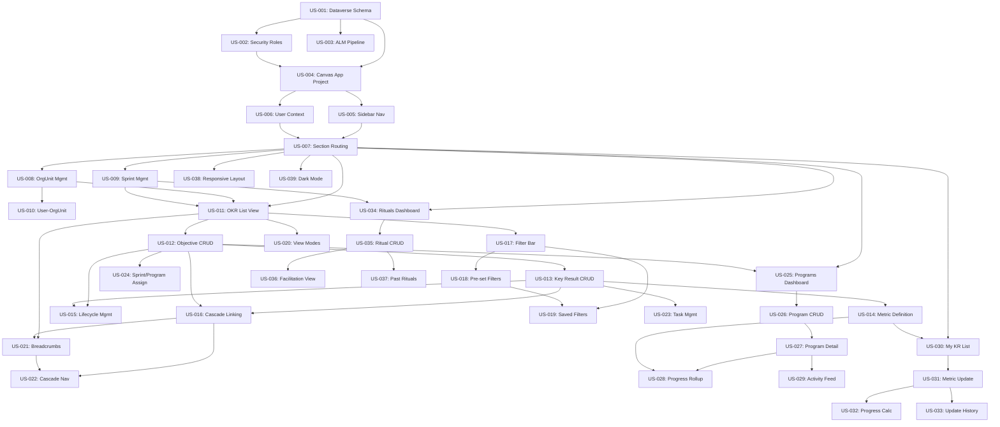

# PowerOne — Product Backlog

> **Platform**: Microsoft Power Platform — Canvas App on Dataverse
> **Publisher prefix**: `po_`
> **Sprint cadence**: 1-week sprints
> **Estimation basis**: Person-days (8h), Fibonacci story points (relative complexity)
> **Assumed velocity**: 10-12 points/sprint

---

## Backlog Summary

| Metric | Value |
|--------|-------|
| **Total Stories** | 39 |
| **Total Story Points** | 194 |
| **Sprint Cadence** | 1-week sprints |
| **Sprints Estimated** | 17-20 (at 10-12 pts/sprint) |
| **Must Have (P1)** | 24 stories, 134 pts |
| **Should Have (P2)** | 11 stories, 44 pts |
| **Could Have (P3)** | 4 stories, 13 pts |
| **Critical Path** | Schema → Security → Shell → OKR List → OKR CRUD → Metrics |

### Effort by Epic

| Epic | Stories | Points | % of Total |
|------|---------|--------|------------|
| E0: Foundation & Infrastructure | 4 | 26 | 14% |
| E1: Application Shell | 3 | 16 | 8% |
| E2: Admin & Master Data | 3 | 13 | 7% |
| E3: OKR Hierarchy | 14 | 86 | 45% |
| E4: Programs | 5 | 26 | 14% |
| E5: Metrics & Progress | 4 | 14 | 7% |
| E6: OKR Rituals | 4 | 13 | 7% |
| **Total** | **39** | **194** | |

---

## Prioritized Backlog

| ID | Title | Points | Priority | Epic | Deps |
|----|-------|--------|----------|------|------|
| US-001 | Deploy Dataverse schema | 8 | P1/Must | E0 | — |
| US-002 | Configure security roles | 5 | P1/Must | E0 | US-001 |
| US-003 | Set up ALM pipeline | 5 | P2/Should | E0 | US-001 |
| US-004 | Create Canvas App project | 8 | P1/Must | E0 | US-001, US-002 |
| US-005 | Build sidebar navigation | 5 | P1/Must | E1 | US-004 |
| US-006 | Implement user context | 3 | P1/Must | E1 | US-004 |
| US-007 | Build section routing | 8 | P1/Must | E1 | US-005, US-006 |
| US-008 | Organizational unit management | 5 | P1/Must | E2 | US-007 |
| US-009 | Sprint management | 5 | P1/Must | E2 | US-007 |
| US-010 | User-OrgUnit assignment | 3 | P1/Must | E2 | US-008 |
| US-011 | OKR list view | 8 | P1/Must | E3 | US-007, US-008, US-009 |
| US-012 | Objective create/edit form | 8 | P1/Must | E3 | US-011 |
| US-013 | Key Result create/edit form | 8 | P1/Must | E3 | US-012 |
| US-014 | Metric definition on Key Results | 5 | P1/Must | E3 | US-013 |
| US-015 | Lifecycle status management | 5 | P1/Must | E3 | US-012, US-013 |
| US-016 | Cascade linking | 5 | P1/Must | E3 | US-013, US-012 |
| US-017 | Filter bar with searchable dropdowns | 8 | P1/Must | E3 | US-011 |
| US-018 | Pre-set filters | 3 | P1/Must | E3 | US-017 |
| US-019 | Custom saved filters | 5 | P2/Should | E3 | US-017, US-018 |
| US-020 | View modes (full, compact, hierarchy) | 8 | P2/Should | E3 | US-011 |
| US-021 | Breadcrumb navigation | 5 | P2/Should | E3 | US-011, US-016 |
| US-022 | Cascade navigation | 5 | P2/Should | E3 | US-016, US-021 |
| US-023 | Task management on Key Results | 5 | P1/Must | E3 | US-013 |
| US-024 | Assign Objectives to Sprint & Programs | 3 | P1/Must | E3 | US-012 |
| US-025 | Programs dashboard | 5 | P1/Must | E4 | US-007, US-012 |
| US-026 | Program create/edit form | 5 | P1/Must | E4 | US-025 |
| US-027 | Program detail view | 5 | P1/Must | E4 | US-026 |
| US-028 | Program progress rollup | 5 | P2/Should | E4 | US-027, US-014 |
| US-029 | Activity feed | 3 | P3/Could | E4 | US-027 |
| US-030 | My Key Results list | 3 | P1/Must | E5 | US-007, US-014 |
| US-031 | Metric value update | 5 | P1/Must | E5 | US-030 |
| US-032 | Progress calculation & display | 3 | P1/Must | E5 | US-031 |
| US-033 | Metric update history | 3 | P2/Should | E5 | US-031 |
| US-034 | Rituals dashboard | 3 | P1/Must | E6 | US-007, US-009 |
| US-035 | Ritual create/edit form | 3 | P1/Must | E6 | US-034 |
| US-036 | Ritual facilitation view | 5 | P2/Should | E6 | US-035 |
| US-037 | Past rituals list | 2 | P3/Could | E6 | US-035 |
| US-038 | Responsive layout | 8 | P3/Could | E1 | US-007 |
| US-039 | Dark mode support | 3 | P3/Could | E1 | US-007 |

---

## Sprint Planning Suggestion

> 1-week sprints at 10-12 points/sprint velocity

| Sprint | Stories | Points | Focus |
|--------|---------|--------|-------|
| **Sprint 1** | US-001, US-002 | 13 | Foundation: Dataverse schema + security roles |
| **Sprint 2** | US-004, US-003 | 13 | Canvas App project + ALM pipeline |
| **Sprint 3** | US-005, US-006 | 8 | Shell: sidebar navigation + user context |
| **Sprint 4** | US-007 | 8 | Shell: section routing + deep linking |
| **Sprint 5** | US-008, US-009 | 10 | Admin: org unit + sprint management |
| **Sprint 6** | US-010, US-011 | 11 | Admin: user-orgunit + OKR list view |
| **Sprint 7** | US-012, US-024 | 11 | OKR: Objective CRUD + sprint/program assign |
| **Sprint 8** | US-013 | 8 | OKR: Key Result CRUD |
| **Sprint 9** | US-014, US-023 | 10 | OKR: metric definition + task management |
| **Sprint 10** | US-015, US-016 | 10 | OKR: lifecycle status + cascade linking |
| **Sprint 11** | US-017, US-018 | 11 | OKR: filter bar + pre-set filters |
| **Sprint 12** | US-019, US-020 | 13 | OKR: saved filters + view modes |
| **Sprint 13** | US-025, US-026 | 10 | Programs: dashboard + CRUD form |
| **Sprint 14** | US-027, US-028, US-029 | 13 | Programs: detail view + rollup + activity feed |
| **Sprint 15** | US-030, US-031 | 8 | Metrics: KR list + value update |
| **Sprint 16** | US-032, US-033 | 6 | Metrics: progress display + update history |
| **Sprint 17** | US-034, US-035 | 6 | Rituals: dashboard + CRUD form |
| **Sprint 18** | US-036, US-037 | 7 | Rituals: facilitation view + past rituals |
| **Sprint 19** | US-021, US-022 | 10 | Polish: breadcrumbs + cascade navigation |
| **Sprint 20** | US-038, US-039 | 11 | Polish: responsive layout + dark mode |

---

## Dependency Graph

---

## Platform Considerations

### Power Platform Effort Factors

| Factor | Assessment | Impact |
|--------|-----------|--------|
| **Data model** | 11 custom tables, 4 N:N relationships, self-referential lookups | Complex (3/3) |
| **Business logic** | Status transitions, cascade validation, progress rollup | Medium-High (2.5/3) |
| **Integrations** | Dataverse only, no external connectors needed | Low (1/3) |
| **UI complexity** | 15+ screens, responsive, three view modes, hierarchy visualization | Complex (3/3) |
| **Security model** | 5 roles with row-level ownership patterns | Medium (2/3) |
| **Environment** | Dev/Test/Prod ALM pipeline | Medium (2/3) |
| **Complexity Score** | **13.5/18** | **Complex** |

### Key Canvas App Risks

- **Delegation**: OKR list filtering with multi-column search must use delegable Dataverse functions only. Non-delegable operations limited to 500/2,000 rows.
- **Hierarchy visualization**: Canvas apps lack native tree rendering. The hierarchy view with connector lines requires custom component or creative use of galleries with calculated indentation.
- **N:N relationships**: Canvas apps have limited native support for N:N. Intersect tables may need to be queried explicitly or use Relate/Unrelate functions.
- **Performance**: Loading Objectives with nested Key Results → Metrics requires careful use of delegation and explicit column selection to avoid large payloads.
- **Progress rollup**: Calculating progress across Objectives → Key Results → Metrics may need a Power Automate flow or Dataverse rollup field for performance.
