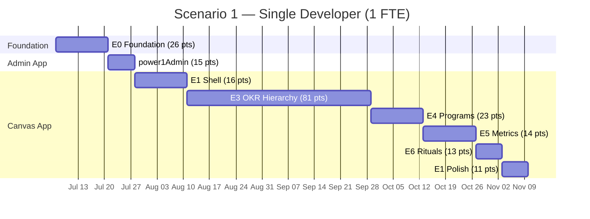
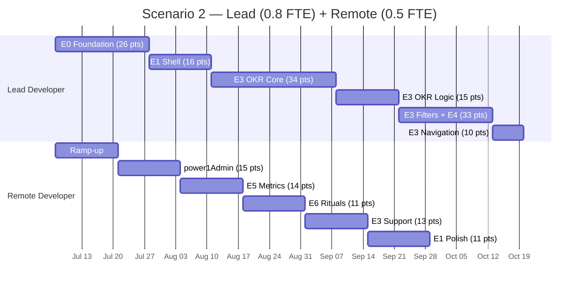

# PowerOne — Implementation Planning

> **Two workstreams** delivering an OKR management platform on Microsoft Power Platform.
> Sprint cadence: 1-week sprints across all scenarios.

---

## Workstream Overview

| Workstream | App Type | Stories | Points | Description |
|------------|----------|---------|--------|-------------|
| **powerOne** | Canvas App | 36 | 184 | Main user-facing OKR application |
| **power1Admin** | Model-Driven App | 6 | 15 | Admin interface for master data management |
| **Total** | | **42** | **199** | |

### Shared Foundation

Both apps share the same Dataverse environment and solution:

- **Dataverse schema** (US-001): single deployment, used by both apps
- **Security roles** (US-002): shared role definitions, applied to both apps
- **ALM pipeline** (US-003): single solution containing both apps
- **Publisher prefix**: `po_` across all components

### Why Two Apps?

| Concern | Canvas App (powerOne) | Model-Driven App (power1Admin) |
|---------|----------------------|-------------------------------|
| **Users** | All team members | Administrators only |
| **Purpose** | OKR browsing, updating, tracking | Org structure, sprints, user assignments |
| **Frequency** | Daily use | Infrequent setup/maintenance |
| **UI needs** | Custom UX, filtering, hierarchy views | Standard CRUD forms and views |
| **Effort** | High (custom development) | Low (configuration-based) |

Model-Driven Apps provide auto-generated forms, views, dashboards, and security — making them the right choice for admin CRUD where custom UX adds no value.

---

## Velocity Assumptions

### Canvas App Development

| Factor | Impact | Notes |
|--------|--------|-------|
| Custom UI galleries and forms | High effort | Every screen is hand-built |
| Power Fx formula complexity | Medium-High | Delegation, N:N, rollups |
| Testing and validation | Medium | Multiple scenarios per feature |
| Performance optimization | Medium | Delegation limits, column selection |

| FTE Level | Velocity (pts/sprint) | Basis |
|-----------|----------------------|-------|
| 1.0 FTE | 10–12 | Full-time, experienced Power Platform dev |
| 0.8 FTE | 8–10 | 4 days/week, lead developer |
| 0.5 FTE | 5–6 | 2.5 days/week, minus coordination overhead |

### Model-Driven App Development

| Factor | Impact | Notes |
|--------|--------|-------|
| Forms and views | Low effort | Auto-generated, configure layout |
| Business rules | Low effort | Declarative, no code |
| Dashboards and charts | Low effort | Point-and-click configuration |
| Security and testing | Low-Medium | Role configuration + validation |

| FTE Level | Velocity (pts/sprint) | Basis |
|-----------|----------------------|-------|
| 1.0 FTE | 12–15 | Configuration is faster than coding |
| 0.5 FTE | 6–8 | Part-time, straightforward work |

---

## Scenario 1: Single Developer (1 FTE)

### Profile

- **Capacity**: 40 hrs/week (5 days × 8 hrs)
- **Sprint**: 1 week
- **Execution**: Sequential — one workstream at a time
- **Ideal for**: Solo developer or small consultancy engagement

### Phase Plan

| Phase | Sprints | Focus | Points | Workstream |
|-------|---------|-------|--------|------------|
| 1. Foundation | 1–2 | Dataverse schema, security, Canvas App setup | 26 | powerOne (E0) |
| 2. Admin App | 3 | Model-Driven App — full delivery | 15 | power1Admin |
| 3. Shell | 4–5 | Sidebar, user context, routing | 16 | powerOne (E1 core) |
| 4. OKR Hierarchy | 6–12 | List, CRUD, filters, views | 81 | powerOne (E3) |
| 5. Programs | 13–14 | Dashboard, CRUD, detail, rollup | 23 | powerOne (E4) |
| 6. Metrics | 15–16 | KR list, updates, progress | 14 | powerOne (E5) |
| 7. Rituals | 17–18 | Dashboard, CRUD, facilitation | 13 | powerOne (E6) |
| 8. Polish | 19 | Responsive layout, dark mode | 11 | powerOne (E1 polish) |

### Timeline

### Summary

| Metric | Optimistic | Realistic | Conservative |
|--------|-----------|-----------|--------------|
| Canvas App sprints | 15 | 17 | 20 |
| Admin App sprints | 1 | 1 | 2 |
| **Total sprints** | **16** | **18** | **22** |
| **Total weeks** | **16** | **18** | **22** |
| **Total FTE-weeks** | **16** | **18** | **22** |

**Key advantage**: Zero coordination overhead, full context retention, no knowledge transfer.

**Key risk**: Single point of failure — illness, vacation, or departure stops all progress.

---

## Scenario 2: Lead Developer (0.8 FTE) + Remote Support (0.5 FTE)

### Team Profile

| Role | Allocation | Hours/Week | Focus |
|------|-----------|------------|-------|
| **Lead Developer** | 0.8 FTE (4 days/week) | 32 | Foundation, Shell, OKR core, Programs |
| **Remote Developer** | 0.5 FTE (2.5 days/week) | 20 | Admin App, Metrics, Rituals, Polish |
| **Combined** | 1.3 FTE | 52 | |

### Coordination Overhead

| Factor | Impact | Mitigation |
|--------|--------|------------|
| Daily standups (15 min) | –2.5 hrs/week combined | Async standup when timezone differs |
| Code/config reviews | –2 hrs/week combined | PR-based reviews on solution exports |
| Knowledge transfer | –5% velocity first 3 sprints | Pair programming during foundation |
| Context switching | –1 pt/sprint remote dev | Clear story boundaries |

**Effective combined Canvas App velocity**: 12–14 pts/sprint (after overhead)

### Parallel Track Strategy

**Track A — Lead Developer**:
Foundation → Shell → E3 OKR core (US-011 through US-016) → E4 Programs → E3 advanced (views, nav)

**Track B — Remote Developer**:
Ramp-up → power1Admin → E5 Metrics → E6 Rituals → E3 filtering (US-017–019) → E1 Polish

### Phase Plan

| Phase | Sprints | Track A (Lead, 0.8 FTE) | Track B (Remote, 0.5 FTE) |
|-------|---------|------------------------|--------------------------|
| 1. Foundation | 1–3 | E0: Schema, security, Canvas App (26 pts) | Ramp-up, environment access, documentation |
| 2. Shell + Admin | 3–5 | E1 core: Sidebar, context, routing (16 pts) | power1Admin: Full delivery (15 pts) |
| 3. OKR Core | 6–9 | E3 core: List, Obj CRUD, KR CRUD, metrics (34 pts) | E5: My KRs, metric update, progress (14 pts) |
| 4. OKR Logic | 10–11 | E3 logic: Lifecycle, cascade, tasks (15 pts) | E6: Rituals dashboard, CRUD, facilitation (11 pts) |
| 5. Filtering + Programs | 12–14 | E3 filters + E4: Programs (33 pts) | E3 support: Saved filters, views (13 pts) |
| 6. Polish | 15–16 | E3 nav: Breadcrumbs, cascade nav (10 pts) | E1 polish: Responsive, dark mode (11 pts) |

### Timeline

### Summary

| Metric | Optimistic | Realistic | Conservative |
|--------|-----------|-----------|--------------|
| Parallel sprints | 14 | 16 | 19 |
| **Total weeks** | **14** | **16** | **19** |
| **Total FTE-weeks** | **18.2** | **20.8** | **24.7** |

**Key advantage**: Faster delivery (2–3 weeks saved). Admin app delivered early — data entry can start while Canvas App is in development.

**Key risk**: Coordination overhead, knowledge gaps, dependency conflicts. Remote developer needs good Power Platform experience and clear documentation.

---

## Scenario Comparison

| Metric | Scenario 1 (1 FTE) | Scenario 2 (0.8 + 0.5 FTE) |
|--------|--------------------|-----------------------------|
| **Realistic duration** | 18 weeks | 16 weeks |
| **Duration range** | 16–22 weeks | 14–19 weeks |
| **Total FTE-weeks** | 18 | 20.8 |
| **Cost efficiency** | Higher (less overhead) | Lower (coordination cost) |
| **Time-to-first-value** | Week 3 (MDA done) | Week 5 (MDA done, earlier features) |
| **Risk: single point of failure** | High | Low |
| **Risk: coordination** | None | Medium |
| **Risk: quality** | Low (single vision) | Medium (review needed) |
| **Admin app delivery** | Week 3 | Week 5 (parallel with shell) |
| **MVP (P1 stories) delivery** | Week 14–16 | Week 12–14 |

### Cost Comparison (illustrative)

Assuming a blended rate of $150/hr for lead and $120/hr for remote:

| | Scenario 1 | Scenario 2 |
|--|-----------|-----------|
| Lead cost | 18w × 40h × $150 = $108,000 | 16w × 32h × $150 = $76,800 |
| Remote cost | — | 16w × 20h × $120 = $38,400 |
| **Total** | **$108,000** | **$115,200** |
| **Per week** | **$6,000** | **$7,200** |

Scenario 2 costs ~7% more total but delivers ~2 weeks faster.

---

## Risk Factors

### Technical Risks

| Risk | Probability | Impact | Mitigation |
|------|------------|--------|------------|
| Delegation limits block complex filtering | Medium | High | Design delegable queries early; test with >500 rows in Sprint 5 |
| N:N relationship complexity in Canvas App | Medium | Medium | Prototype Relate/Unrelate in Sprint 6; fall back to intersect table queries |
| Hierarchy view performance | High | Medium | Start with indentation-only MVP; defer connector lines |
| Progress rollup calculation timing | Medium | Medium | Implement Power Automate flow early (Sprint 13); test with realistic data volumes |
| Canvas App size limits | Low | High | Monitor app size; use component libraries to share controls |

### Organizational Risks

| Risk | Probability | Impact | Mitigation |
|------|------------|--------|------------|
| Requirement changes mid-sprint | Medium | Medium | 1-week sprints limit blast radius; use backlog refinement |
| Stakeholder availability for testing | Medium | Medium | Schedule demo at end of each sprint |
| Environment provisioning delays | Low | High | Request environments in Sprint 0 (before development starts) |
| Licensing procurement | Low | High | Confirm Power Apps Premium licenses before Sprint 1 |

### Scenario-Specific Risks

| Risk | Scenario 1 | Scenario 2 |
|------|-----------|-----------|
| Developer unavailability | **Critical** — project stops | Medium — other dev continues at reduced velocity |
| Knowledge silos | Low — one person knows everything | **High** — mitigate with documentation and pair sessions |
| Merge conflicts | None | Medium — coordinate solution exports carefully |
| Onboarding remote dev | N/A | **High** — allow 2 sprints for productive ramp-up |

---

## Recommendations

### For a Solo Developer or Small Team (Scenario 1)

1. **Start with power1Admin** — delivers admin capability in 1 sprint, enables data entry immediately
2. **Front-load E3 (OKR Hierarchy)** — it's 44% of total effort and the core value proposition
3. **Defer P2/P3 stories** to a second release cycle (saves 5–6 sprints)
4. **MVP cut** (P1 only): 24 Canvas App stories + 6 MDA stories = 30 stories, ~142 pts, ~13–15 sprints

### For a Split Team (Scenario 2)

1. **Lead owns the critical path**: Foundation → Shell → OKR CRUD → Programs
2. **Remote dev starts with power1Admin** — independent, low-risk, builds confidence
3. **Clear handoff boundaries**: remote dev takes ownership of full sections (Metrics, Rituals) not partial stories within a section
4. **Weekly sync on solution merges** — export/import managed solutions carefully
5. **Shared test environment** with clear data partitioning

### General

- **Sprint 0** (pre-development): Provision environments, procure licenses, configure ALM pipeline, set up source control
- **Build power1Admin first** in both scenarios — it unblocks admin data entry and validates the Dataverse schema
- **Use the backlog CSV files** for import into Azure DevOps or Jira for sprint tracking
- **Review velocity after Sprint 3** and adjust forecasts — initial sprints are often slower due to environment setup and learning

---

## Backlog References

- [powerOne Backlog (Canvas App)](powerOne/backlog.md) — 36 stories, 184 pts
- [power1Admin Backlog (Model-Driven App)](power1Admin/backlog.md) — 6 stories, 15 pts
- [powerOne Story Cards](powerOne/stories.md) — detailed acceptance criteria
- [power1Admin Story Cards](power1Admin/stories.md) — detailed acceptance criteria
