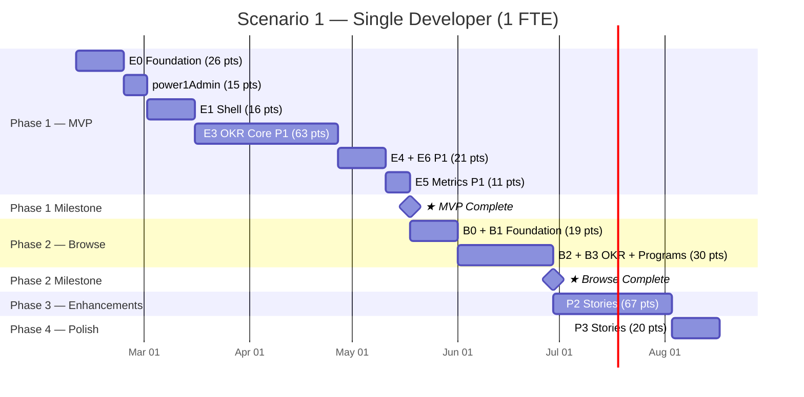
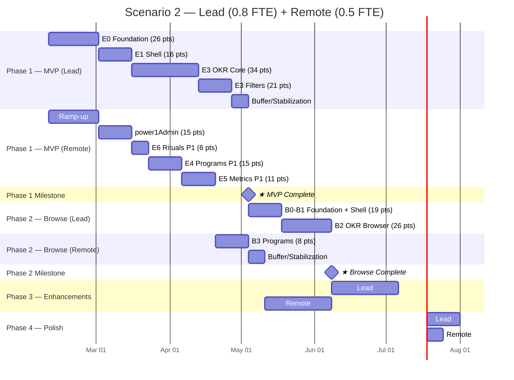

# PowerOne — Implementation Planning

> **Three workstreams** delivering an OKR management platform on Microsoft Power Platform.
> Sprint cadence: 1-week sprints across all scenarios.
> **Start date**: 2026-02-09
> **MVP-first delivery**: all P1/Must Have stories are completed before Phase 2 work begins.

---

## Workstream Overview

| Workstream | App Type | Users | Stories | Points | Description |
|------------|----------|-------|---------|--------|-------------|
| **powerOne** | Canvas App (Dataverse) | 250 | 36 | 184 | Main user-facing OKR application (CRUD) |
| **power1Admin** | Model-Driven App (Dataverse) | 5 | 6 | 15 | Admin interface for master data management |
| **power1Browse** | Canvas App (SharePoint) | 600 | 18 | 79 | Read-only OKR browser (Phase 2) |
| **Total** | | **855** | **60** | **278** | |

### Delivery Phases

| Phase | Scope | Workstreams | Stories | Points |
|-------|-------|-------------|---------|--------|
| **Phase 1 — MVP** | Core OKR management | powerOne (P1) + power1Admin | 30 stories | 142 pts |
| **Phase 2 — Browse** | Read-only browser for all users | power1Browse (P1) | 12 stories | 49 pts |
| **Phase 3 — Enhancements** | Advanced features | powerOne (P2) + power1Browse (P2) | 13 stories | 67 pts |
| **Phase 4 — Polish** | Nice-to-haves | powerOne (P3) + power1Browse (P3) | 5 stories | 20 pts |

### Shared Foundation

All three apps share the same Dataverse environment and solution:

- **Dataverse schema** (US-001): single deployment, used by all apps
- **Security roles** (US-002): shared role definitions, applied to powerOne and power1Admin
- **ALM pipeline** (US-003): single solution containing all apps
- **Publisher prefix**: `po_` across all components
- **SharePoint sync** (BS-002): Power Automate replicates Dataverse data to SharePoint Lists for power1Browse

### Why Three Apps?

| Concern | powerOne (Canvas App) | power1Admin (Model-Driven) | power1Browse (Canvas App) |
|---------|----------------------|---------------------------|--------------------------|
| **Users** | 250 | 5 | 600 |
| **Purpose** | OKR CRUD, metric updates, full management | Org structure, sprints, user assignments | Read-only OKR browsing |
| **Data source** | Dataverse (premium connector) | Dataverse (premium connector) | SharePoint Lists (standard connector) |
| **License** | Power Apps Premium (€6/user/month) | Power Apps Premium (€6/user/month) | M365 E3/E5 (included, €0 extra) |
| **Frequency** | Daily use | Infrequent setup/maintenance | Daily use |
| **Effort** | High (custom development) | Low (configuration-based) | Medium (standard connector + sync) |

### Licensing Strategy

| Scenario | Monthly Cost | Annual Cost |
|----------|-------------|-------------|
| All 855 users on Power Apps Premium (€6/user) | €5,130 | €61,560 |
| **Hybrid: 255 Premium + 600 M365 + 1 sync flow** | **€1,545** | **€18,540** |
| **Annual savings** | | **€43,020** |

The hybrid approach uses SharePoint Lists as a **read replica** of Dataverse. A single Power Automate flow (requiring 1 Premium license at ~€15/month) syncs data from Dataverse to SharePoint in near real-time. The power1Browse Canvas App reads only from SharePoint using the standard connector, which is included in M365 E3/E5 at no additional cost.

**Critical rule**: power1Browse must use **only standard connectors** (SharePoint, Office 365 Users). Adding even one premium connector triggers €6/user/month for all 600 users.

---

## Epic Overview

### powerOne — Canvas App (36 stories, 184 pts)

| Epic | Description | Stories | Points | Phase |
|------|-------------|---------|--------|-------|
| **E0: Foundation** | Dataverse schema, security roles, Canvas App project | 3 | 21 | MVP |
| **E1: Shell** | Sidebar navigation, user context, section routing | 3 | 16 | MVP |
| **E3: OKR Hierarchy** | OKR list, CRUD forms, metrics, tasks, filters, cascade | 14 | 74 | MVP (P1) + Enhancements (P2) |
| **E4: Programs** | Program dashboard, CRUD, detail view, progress rollup | 4 | 20 | MVP (P1) + Enhancements (P2) |
| **E5: Metrics & Progress** | My KR list, metric value updates, progress calculation, history | 4 | 14 | MVP (P1) + Enhancements (P2) |
| **E6: OKR Rituals** | Rituals dashboard, CRUD, facilitation view | 3 | 11 | MVP (P1) + Enhancements (P2) |

Plus cross-cutting: US-003 (ALM Pipeline, P2), US-038 (Responsive, P3), US-039 (Dark Mode, P3), US-029 (Activity Feed, P3), US-037 (Past Rituals, P3).

### power1Admin — Model-Driven App (6 stories, 15 pts)

| Epic | Description | Stories | Points | Phase |
|------|-------------|---------|--------|-------|
| **Admin App** | MDA creation, org unit CRUD, sprint CRUD, user-org assignments, dashboard, security | 6 | 15 | MVP |

### power1Browse — Canvas App on SharePoint (18 stories, 79 pts)

| Epic | Description | Stories | Points | Phase |
|------|-------------|---------|--------|-------|
| **B0: Foundation** | SharePoint site & lists, Dataverse-to-SharePoint sync flows, validation | 3 | 11 | Phase 2 |
| **B1: Shell & Navigation** | Canvas App shell, sprint selector | 2 | 8 | Phase 2 |
| **B2: OKR Browser** | OKR list view, filters, detail views, search | 5 | 26 | Phase 2 |
| **B3: Programs Browser** | Programs dashboard, program detail with linked OKRs | 2 | 8 | Phase 2 |
| **B4: Sync Enhancements** | N:N junction sync flows, "last synced" indicator | 2 | 6 | Enhancements |
| **B5: Visual Enhancements** | Progress visualization, dark mode | 2 | 8 | Enhancements + Polish |
| **B6: Analytics** | Embedded Power BI dashboard, metric history view | 2 | 12 | Enhancements |

---

## Component Library Strategy

The Canvas App builds a **Canvas Component Library** (`po_ComponentLibrary`) with 12 reusable components. Components are created during their first use and reused by subsequent stories. Each component is a flat, self-contained unit built from standard controls — Canvas Apps do not support nesting components inside other components.

| Component | Built In | Reused In | Description | Impact |
|-----------|----------|-----------|-------------|--------|
| `po_SidePanel` | US-012 (S6) | US-013, US-014, US-026, US-035 | Slide-out panel for create/edit forms | 4 stories benefit |
| `po_StatusBadge` | US-011 (S5) | US-012, US-015, US-025, US-030, US-034 | Color-coded lifecycle status label | 5 stories benefit |
| `po_ProgressIndicator` | US-011 (S5) | US-025, US-027, US-030, US-032 | Progress bar with percentage and color coding | 4 stories benefit |
| `po_SearchableDropdown` | US-017 (S10) | US-012, US-013, US-026 | Filterable dropdown for large option sets | 3 stories benefit |
| `po_FilterChip` | US-017 (S10) | US-025, US-034 | Removable filter tag | 2 stories benefit |
| `po_CardContainer` | US-025 (S11) | US-027, US-034 | Card layout wrapper with consistent padding/shadow | 2 stories benefit |
| `po_EmptyState` | US-011 (S5) | US-025, US-030, US-034 | Placeholder for empty galleries | 3 stories benefit |
| `po_ConfirmDialog` | US-015 (S9) | US-016, US-023 | Confirmation modal for destructive actions | 2 stories benefit |
| `po_UserAvatar` | US-006 (S3) | US-011, US-023, US-030 | User photo/initials circle with name | 3 stories benefit |
| `po_TaskItem` | US-023 (S8) | — | Checkbox + task title row | Standalone |
| `po_ObjectiveCard` | US-011 (S5) | US-020, US-022, US-027 | Objective row with status, progress, owner, expand/collapse | 3 stories benefit |
| `po_KeyResultCard` | US-011 (S5) | US-020, US-022, US-030 | Key Result row with status, progress, metric summary | 3 stories benefit |

> **Platform constraint**: Canvas components cannot contain other canvas components. `po_ObjectiveCard` and `po_KeyResultCard` internally rebuild status badge, progress bar, and avatar patterns using standard controls rather than referencing `po_StatusBadge`, `po_ProgressIndicator`, or `po_UserAvatar`. This means visual changes to status badges or progress bars must be updated in multiple components. Mitigate by establishing a shared color/sizing convention documented in the component library.

**Velocity impact**: After Sprint 5 (all 12 components built), effective velocity increases ~15–20% due to component reuse. This is reflected in the post-MVP phase velocities (12–14 pts/sprint vs 10–12).

---

## Velocity Assumptions

### Canvas App Development

| Factor | Impact | Notes |
|--------|--------|-------|
| Custom UI galleries and forms | High effort | Every screen is hand-built |
| Power Fx formula complexity | Medium-High | Delegation, N:N, rollups |
| Component library creation | Front-loaded | Extra effort in Sprints 2–10, payoff in 11+ |
| Component reuse | Accelerates later sprints | Post-MVP stories heavily benefit |

| FTE Level | Phase | Velocity (pts/sprint) |
|-----------|-------|----------------------|
| 1.0 FTE | MVP (building components) | 10–12 |
| 1.0 FTE | Post-MVP (reusing components) | 12–14 |
| 0.8 FTE | MVP | 8–10 |
| 0.8 FTE | Post-MVP | 10–12 |
| 0.5 FTE | MVP | 5–6 |
| 0.5 FTE | Post-MVP | 6–8 |

### Model-Driven App Development

| FTE Level | Velocity (pts/sprint) | Basis |
|-----------|----------------------|-------|
| 1.0 FTE | 12–15 | Configuration is faster than coding |
| 0.5 FTE | 6–8 | Part-time, straightforward work |

---

## Scenario 1: Single Developer (1 FTE)

### Profile

- **Capacity**: 40 hrs/week (5 days × 8 hrs)
- **Sprint**: 1 week
- **Start date**: 2026-02-09
- **Execution**: Sequential — one workstream at a time
- **Ideal for**: Solo developer or small consultancy engagement

### Phase Plan

| Phase | Sprints | Focus | Points | Workstream | Milestone |
|-------|---------|-------|--------|------------|-----------|
| 1. Foundation | 1–2 | Dataverse schema, security, Canvas App + Component Library | 26 | powerOne (E0) | |
| 2. Admin App | 3 | Model-Driven App — full delivery | 15 | power1Admin | Admin data entry enabled |
| 3. Shell | 4–5 | Sidebar, user context, routing | 16 | powerOne (E1) | |
| 4. OKR Core | 6–11 | List, CRUD, metrics, tasks, filters | 63 | powerOne (E3 P1) | All core components built |
| 5. Programs + Rituals | 12–13 | Dashboard, CRUD, detail + Rituals dash & CRUD | 21 | powerOne (E4, E6 P1) | |
| 6. Metrics | 14 | KR list, value update, progress calculation | 11 | powerOne (E5 P1) | **★ Phase 1 — MVP Complete** |
| 7. Browse Foundation | 15–16 | SharePoint lists, sync flows, Canvas App shell | 19 | power1Browse (B0, B1) | Sync operational |
| 8. Browse OKR + Programs | 17–20 | OKR browser, filters, detail views, Programs | 30 | power1Browse (B2, B3) | **★ Phase 2 — Browse Complete** |
| 9. Enhancements | 21–25 | powerOne P2 + power1Browse P2 | 67 | powerOne + power1Browse | Phase 3 complete |
| 10. Polish | 26–27 | powerOne P3 + power1Browse P3 | 20 | powerOne + power1Browse | Full product |

### Timeline

### Summary

| Metric | Optimistic | Realistic | Conservative |
|--------|-----------|-----------|--------------|
| **Phase 1 — MVP** | **Sprint 13** | **Sprint 14** | **Sprint 16** |
| **Phase 2 — Browse** | Sprint 18 | Sprint 20 | Sprint 22 |
| **Full product** | Sprint 25 | Sprint 27 | Sprint 30 |
| Total FTE-weeks | 25 | 27 | 30 |

**Key advantage**: Zero coordination overhead, full context retention, clear phase milestones.

**Key risk**: Single point of failure — illness, vacation, or departure stops all progress.

---

## Scenario 2: Lead Developer (0.8 FTE) + Remote Support (0.5 FTE)

### Team Profile

| Role | Allocation | Hours/Week | Focus |
|------|-----------|------------|-------|
| **Lead Developer** | 0.8 FTE (4 days/week) | 32 | Foundation, Shell, OKR core (critical path) |
| **Remote Developer** | 0.5 FTE (2.5 days/week) | 20 | Admin App, Programs, Metrics, Rituals, then Browse |
| **Combined** | 1.3 FTE | 52 | |

### Coordination Overhead

| Factor | Impact | Mitigation |
|--------|--------|------------|
| Daily standups (15 min) | –2.5 hrs/week combined | Async standup when timezone differs |
| Code/config reviews | –2 hrs/week combined | PR-based reviews on solution exports |
| Knowledge transfer | –5% velocity first 3 sprints | Pair programming during foundation |
| Context switching | –1 pt/sprint remote dev | Clear story boundaries per section |

### Parallel Track Strategy

**Track A — Lead Developer** (critical path):
Foundation → Shell → E3 OKR core → power1Browse (B0–B3) → P2 advanced (views, navigation)

**Track B — Remote Developer** (parallel sections):
Ramp-up → power1Admin → E6 Rituals → E4 Programs → E5 Metrics → power1Browse P2 → P3 polish

### Phase Plan

| Phase | Sprints | Track A (Lead, 0.8 FTE) | Track B (Remote, 0.5 FTE) | Milestone |
|-------|---------|------------------------|--------------------------|-----------|
| 1. Foundation | 1–3 | E0: Schema, security, Canvas App + Components (26 pts) | Ramp-up, environment access | |
| 2. Shell + Admin | 4–5 | E1: Sidebar, context, routing (16 pts) | power1Admin: Full delivery (15 pts) | Admin app live |
| 3. OKR Core | 6–9 | E3: List, Obj CRUD, KR CRUD, Metrics, Tasks (34 pts) | E6: Rituals P1 (6 pts), then E4: Programs after US-012 done (10 pts) | |
| 4. OKR Logic + Filters | 10–11 | E3: Lifecycle, cascade, filters (21 pts) | E4: Program detail (5 pts) + E5: Metrics (11 pts) | |
| 5. MVP wrap-up | 12 | Sprint buffer / stabilization | Sprint buffer / stabilization | **★ Phase 1 — MVP Complete** |
| 6. Browse | 13–16 | B0–B1: SharePoint, sync, shell (19 pts) | B2–B3: OKR browser, programs (34 pts) | |
| 7. Browse wrap-up | 17 | Buffer / stabilization | Buffer / stabilization | **★ Phase 2 — Browse Complete** |
| 8. Enhancements | 18–22 | powerOne P2 (41 pts) | power1Browse P2 (26 pts) | Phase 3 complete |
| 9. Polish | 23–24 | powerOne P3 (16 pts) | power1Browse P3 (4 pts) | Full product |

### Timeline

### Summary

| Metric | Optimistic | Realistic | Conservative |
|--------|-----------|-----------|--------------|
| **Phase 1 — MVP** | **Sprint 10** | **Sprint 12** | **Sprint 14** |
| **Phase 2 — Browse** | Sprint 14 | Sprint 17 | Sprint 19 |
| **Full product** | Sprint 22 | Sprint 24 | Sprint 27 |
| Total FTE-weeks | 28.6 | 31.2 | 35.1 |

**Key advantage**: MVP delivered 2–3 weeks faster. Admin app live early. power1Browse can start immediately after MVP with both developers. Component library available to both devs after Sprint 6.

**Key risk**: Remote developer depends on Lead completing US-012 (Objective CRUD + SidePanel component) before starting Programs. Coordination on solution exports.

---

## Scenario Comparison

| Metric | Scenario 1 (1 FTE) | Scenario 2 (0.8 + 0.5 FTE) |
|--------|--------------------|-----------------------------|
| **Phase 1 — MVP** | **Week 14** | **Week 12** |
| **Phase 2 — Browse** | Week 20 | Week 17 |
| **Full product** | Week 27 | Week 24 |
| **Duration range** | 25–30 weeks | 22–27 weeks |
| **Total FTE-weeks** | 27 | 31.2 |
| **Cost efficiency** | Higher (less overhead) | Lower (coordination cost) |
| **Admin app delivery** | Week 3 | Week 5 (parallel with shell) |
| **Browse delivery** | Week 20 (sequential) | Week 17 (parallel tracks) |
| **Risk: single point of failure** | High | Low |
| **Risk: coordination** | None | Medium |
| **Risk: quality** | Low (single vision) | Medium (review needed) |

### Cost Comparison (illustrative)

Assuming €150/hr for lead and €50/hr for remote:

| | Scenario 1 | Scenario 2 |
|--|-----------|-----------|
| Lead cost | 27w × 40h × €150 = €162,000 | 24w × 32h × €150 = €115,200 |
| Remote cost | — | 24w × 20h × €50 = €24,000 |
| **Total** | **€162,000** | **€139,200** |
| **Per week** | **€6,000** | **€5,800** |
| **Cost to MVP** | €84,000 (14w) | €69,600 (12w) |
| **Cost to Browse** | €120,000 (20w) | €98,600 (17w) |

Scenario 2 costs ~14% less total and delivers Browse ~3 weeks faster. Cost-to-MVP is ~17% lower.

---

## Risk Factors

### Technical Risks

| Risk | Probability | Impact | Mitigation |
|------|------------|--------|------------|
| Delegation limits block complex filtering | Medium | High | Design delegable queries early; test with >500 rows in Sprint 5 |
| N:N relationship complexity in Canvas App | Medium | Medium | Prototype Relate/Unrelate in Sprint 6; fall back to intersect table queries |
| Component library limitations | Medium | Medium | Test component patterns in Sprint 2; plan workarounds for event model limitations |
| Hierarchy view performance | High | Medium | Start with indentation-only MVP; defer connector lines to P2 |
| Progress rollup calculation timing | Medium | Medium | Implement Power Automate flow in Sprint 15 (P2); test with realistic data volumes |
| Canvas App size limits | Low | High | Monitor app size; component library keeps main app smaller |

### Organizational Risks

| Risk | Probability | Impact | Mitigation |
|------|------------|--------|------------|
| Requirement changes mid-sprint | Medium | Medium | 1-week sprints limit blast radius; use backlog refinement |
| Stakeholder availability for testing | Medium | Medium | Schedule demo at end of each sprint; MVP demo at Sprint 13/14 |
| Environment provisioning delays | Low | High | Request environments in Sprint 0 (before development starts) |
| Licensing procurement | Low | High | Confirm Power Apps Premium licenses (€6/user × 255 users) before Sprint 1 |
| SharePoint sync flow reliability | Medium | Medium | Event-triggered + scheduled reconciliation; monitor via Power Automate analytics |
| power1Browse classified as Premium | Medium | High | Verify app license designation is "Standard"; never add premium connectors |

### Scenario-Specific Risks

| Risk | Scenario 1 | Scenario 2 |
|------|-----------|-----------|
| Developer unavailability | **Critical** — project stops | Medium — other dev continues at reduced velocity |
| Knowledge silos | Low — one person knows everything | **High** — mitigate with documentation and pair sessions |
| Merge conflicts | None | Medium — coordinate solution exports carefully |
| Onboarding remote dev | N/A | **High** — allow 2–3 sprints for productive ramp-up |
| Component reuse coordination | N/A | Medium — Remote dev needs to learn component library |

---

## Recommendations

### Phased Delivery

1. **Phase 1 (MVP) complete before Phase 2 (Browse)** — ensures 250 power users have a working OKR platform before extending to 600 read-only viewers
2. **MVP demo at Sprint 13–14** — stakeholders see the full core product before browse development begins
3. **Phase 2 can be descoped** — if timelines tighten, the MVP is already deployed and usable for 250 users
4. **Component library pays dividends** — by Sprint 5, all 12 components exist, accelerating all stories that display OKRs across sections
5. **power1Browse starts with sync validation** — build and test the Dataverse→SharePoint data pipeline before any Canvas App development

### For a Solo Developer (Scenario 1)

1. **Build power1Admin in Sprint 3** — delivers admin capability immediately, enables data entry
2. **Front-load component-building stories** — invest in `po_ObjectiveCard`, `po_KeyResultCard`, `po_SidePanel`, `po_StatusBadge`, `po_ProgressIndicator` early (Sprints 5–6) to accelerate Sprints 7+
3. **MVP target: Sprint 14** — 24 P1 Canvas App stories + 6 MDA stories = 30 stories complete
4. **If time-constrained**: ship MVP at Sprint 14 and defer all P2/P3 to a follow-up engagement

### For a Split Team (Scenario 2)

1. **Lead owns the critical path**: Foundation → Shell → OKR CRUD (builds all core components)
2. **Remote dev starts with power1Admin** — independent, low-risk, builds confidence
3. **Component handoff at Sprint 6**: Remote dev starts using `po_SidePanel`, `po_ObjectiveCard`, and other components when moving to Programs and Rituals
4. **Clear section ownership**: Remote dev takes full ownership of E4 Programs, E5 Metrics, E6 Rituals — no partial story handoffs
5. **Weekly sync on solution merges** — export/import managed solutions carefully
6. **MVP convergence at Sprint 12** — both tracks should have all P1 stories done; Sprint 12 is buffer/stabilization

### For power1Browse (Phase 2)

1. **Start after Phase 1 MVP** — Dataverse must be deployed and populated with real data before sync flows have meaningful data to work with
2. **Can be developed in parallel** by a second developer — no code dependencies, only data dependencies
3. **Sync flows first** — validate the data pipeline before building the Canvas App
4. **Verify license designation** — check that the Canvas App shows "Standard" designation in Power Apps admin before distributing to 600 users
5. **Never add premium connectors** — this is the single most critical rule; adding Dataverse, SQL, or custom connectors triggers €6/user/month for all 600 users (€3,600/month)
6. **Phase 2 complete at Sprint 6** (from power1Browse start) — 12 stories deliver full read-only OKR + Programs browsing

### General

- **Sprint 0** (pre-development): Provision environments, procure licenses, set up source control, provision SharePoint site for power1Browse
- **Build power1Admin early** in both scenarios — it unblocks admin data entry and validates the Dataverse schema
- **Use the backlog CSV files** for import into Azure DevOps or Jira for sprint tracking (includes Phase and Components columns)
- **Review velocity after Sprint 3** and adjust forecasts — initial sprints are often slower due to environment setup
- **Component library review at Sprint 6** — validate that all 12 components (`po_ObjectiveCard`, `po_KeyResultCard`, etc.) work across sections before remote dev starts using them
- **License audit before go-live** — verify 255 powerOne/power1Admin users have Power Apps Premium (€6/user), 600 power1Browse users have M365 E3/E5, sync flow owner has Power Automate Premium (~€15/month)

---

## Backlog References

- [powerOne Backlog (Canvas App)](powerOne/backlog.md) — 36 stories, 184 pts, component matrix, MVP-first sprint plan
- [power1Admin Backlog (Model-Driven App)](power1Admin/backlog.md) — 6 stories, 15 pts
- [power1Browse Backlog (Read-Only Browser)](power1Browse/backlog.md) — 18 stories, 79 pts, SharePoint data model, sync architecture
- [powerOne Story Cards](powerOne/stories.md) — detailed acceptance criteria with component build/reuse notes
- [power1Admin Story Cards](power1Admin/stories.md) — detailed acceptance criteria
- [power1Browse Story Cards](power1Browse/stories.md) — detailed acceptance criteria with delegation notes
