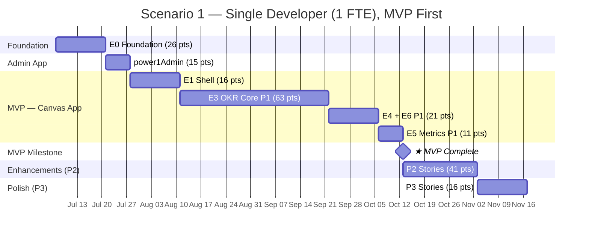
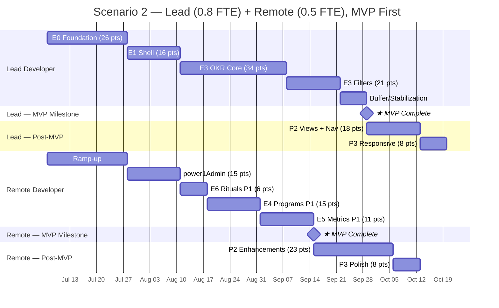

# PowerOne — Implementation Planning

> **Three workstreams** delivering an OKR management platform on Microsoft Power Platform.
> Sprint cadence: 1-week sprints across all scenarios.
> **MVP-first delivery**: all P1/Must Have stories are completed before P2/P3 work begins.

---

## Workstream Overview

| Workstream | App Type | Stories | Points | Description |
|------------|----------|---------|--------|-------------|
| **powerOne** | Canvas App (Dataverse) | 36 | 184 | Main user-facing OKR application (CRUD) |
| **power1Admin** | Model-Driven App (Dataverse) | 6 | 15 | Admin interface for master data management |
| **power1Browse** | Canvas App (SharePoint) | 18 | 79 | Read-only OKR browser for 500+ users |
| **Total** | | **60** | **278** | |

### Delivery Phases

| Phase | Scope | powerOne | power1Admin | power1Browse | Combined |
|-------|-------|----------|-------------|-------------|----------|
| **MVP** (P1/Must Have) | Core product | 24 stories, 127 pts | 6 stories, 15 pts | 12 stories, 49 pts | 42 stories, 191 pts |
| **Enhancements** (P2/Should Have) | Advanced features | 8 stories, 41 pts | — | 5 stories, 26 pts | 13 stories, 67 pts |
| **Polish** (P3/Could Have) | Nice-to-haves | 4 stories, 16 pts | — | 1 story, 4 pts | 5 stories, 20 pts |

### Shared Foundation

All three apps share the same Dataverse environment and solution:

- **Dataverse schema** (US-001): single deployment, used by all apps
- **Security roles** (US-002): shared role definitions, applied to powerOne and power1Admin
- **ALM pipeline** (US-003): single solution containing all apps
- **Publisher prefix**: `po_` across all components
- **SharePoint sync** (BS-002): Power Automate replicates Dataverse data to SharePoint Lists for power1Browse

### Why Three Apps?

| Concern | powerOne (Canvas App) | power1Admin (Model-Driven) | power1Browse (Canvas App) |
|---------|----------------------|---------------------------|--------------------------|
| **Users** | ~30 power users | Administrators only | 500+ read-only viewers |
| **Purpose** | OKR CRUD, metric updates, full management | Org structure, sprints, user assignments | Read-only OKR browsing |
| **Data source** | Dataverse (premium connector) | Dataverse (premium connector) | SharePoint Lists (standard connector) |
| **License** | Power Apps Premium ($20/user/month) | Power Apps Premium ($20/user/month) | M365 E3/E5 (included, $0 extra) |
| **Frequency** | Daily use | Infrequent setup/maintenance | Daily use |
| **Effort** | High (custom development) | Low (configuration-based) | Medium (standard connector + sync) |

### Licensing Strategy

| Scenario | Monthly Cost | Annual Cost |
|----------|-------------|-------------|
| All 530 users on Power Apps Premium | $10,600 | $127,200 |
| **Hybrid: 30 Premium + 500 M365 + 1 sync flow** | **$615** | **$7,380** |
| **Annual savings** | | **$119,820** |

The hybrid approach uses SharePoint Lists as a **read replica** of Dataverse. A single Power Automate flow (requiring 1 Premium license at $15/month) syncs data from Dataverse to SharePoint in near real-time. The power1Browse Canvas App reads only from SharePoint using the standard connector, which is included in M365 E3/E5 at no additional cost.

**Critical rule**: power1Browse must use **only standard connectors** (SharePoint, Office 365 Users). Adding even one premium connector triggers premium licensing for all 500+ users.

---

## Component Library Strategy

The Canvas App builds a **Canvas Component Library** (`po_ComponentLibrary`) with 12 reusable components organized in two tiers: 10 primitive components (single-purpose UI elements) and 2 composite components (domain-specific assemblies that compose primitives). Components are created during their first use and reused by subsequent stories.

#### Primitive Components

| Component | Built In | Reused In | Impact |
|-----------|----------|-----------|--------|
| `po_SidePanel` | US-012 (S6) | US-013, US-014, US-026, US-035 | 4 stories benefit |
| `po_StatusBadge` | US-011 (S5) | US-012, US-015, US-025, US-030, US-034 | 5 stories benefit |
| `po_ProgressIndicator` | US-011 (S5) | US-025, US-027, US-030, US-032 | 4 stories benefit |
| `po_SearchableDropdown` | US-017 (S10) | US-012, US-013, US-026 | 3 stories benefit |
| `po_FilterChip` | US-017 (S10) | US-025, US-034 | 2 stories benefit |
| `po_CardContainer` | US-025 (S11) | US-027, US-034 | 2 stories benefit |
| `po_EmptyState` | US-011 (S5) | US-025, US-030, US-034 | 3 stories benefit |
| `po_ConfirmDialog` | US-015 (S9) | US-016, US-023 | 2 stories benefit |
| `po_UserAvatar` | US-006 (S3) | US-011, US-023, US-030 | 3 stories benefit |
| `po_TaskItem` | US-023 (S8) | — | Standalone |

#### Composite Components

| Component | Built In | Reused In | Composes | Impact |
|-----------|----------|-----------|----------|--------|
| `po_ObjectiveCard` | US-011 (S5) | US-020, US-022, US-027 | StatusBadge, ProgressIndicator, UserAvatar | 3 stories benefit |
| `po_KeyResultCard` | US-011 (S5) | US-020, US-022, US-030 | StatusBadge, ProgressIndicator | 3 stories benefit |

The composite components eliminate redundant re-implementation of Objective and Key Result display layouts across sections. Without them, US-020 (View Modes), US-022 (Cascade Navigation), US-027 (Program Detail), and US-030 (My KR List) would each independently rebuild the same row layout with status badges, progress indicators, and owner avatars.

**Velocity impact**: After Sprint 5 (composite components built alongside primitives), effective velocity increases ~15–20% due to component reuse. This is reflected in the post-MVP phase velocities (12–14 pts/sprint vs 10–12).

---

## Velocity Assumptions

### Canvas App Development

| Factor | Impact | Notes |
|--------|--------|-------|
| Custom UI galleries and forms | High effort | Every screen is hand-built |
| Power Fx formula complexity | Medium-High | Delegation, N:N, rollups |
| Component library creation | Front-loaded | Extra effort in Sprints 2–10, payoff in 11+ |
| Component reuse | Accelerates later sprints | Post-MVP stories heavily benefit |

| FTE Level | Phase | Velocity (pts/sprint) |
|-----------|-------|----------------------|
| 1.0 FTE | MVP (building components) | 10–12 |
| 1.0 FTE | Post-MVP (reusing components) | 12–14 |
| 0.8 FTE | MVP | 8–10 |
| 0.8 FTE | Post-MVP | 10–12 |
| 0.5 FTE | MVP | 5–6 |
| 0.5 FTE | Post-MVP | 6–8 |

### Model-Driven App Development

| FTE Level | Velocity (pts/sprint) | Basis |
|-----------|----------------------|-------|
| 1.0 FTE | 12–15 | Configuration is faster than coding |
| 0.5 FTE | 6–8 | Part-time, straightforward work |

---

## Scenario 1: Single Developer (1 FTE)

### Profile

- **Capacity**: 40 hrs/week (5 days × 8 hrs)
- **Sprint**: 1 week
- **Execution**: Sequential — one workstream at a time
- **Ideal for**: Solo developer or small consultancy engagement

### Phase Plan

| Phase | Sprints | Focus | Points | Workstream | Milestone |
|-------|---------|-------|--------|------------|-----------|
| 1. Foundation | 1–2 | Dataverse schema, security, Canvas App + Component Library | 26 | powerOne (E0) | |
| 2. Admin App | 3 | Model-Driven App — full delivery | 15 | power1Admin | Admin data entry enabled |
| 3. Shell | 4–5 | Sidebar, user context, routing | 16 | powerOne (E1 core) | |
| 4. OKR Core | 6–11 | List, CRUD, metrics, tasks, filters | 63 | powerOne (E3 P1) | All core components built |
| 5. Programs | 12–13 | Dashboard, CRUD, detail + Rituals dash & CRUD | 21 | powerOne (E4, E6 P1) | |
| 6. Metrics | 14 | KR list, value update, progress calculation | 11 | powerOne (E5 P1) | **★ MVP Complete** |
| 7. Enhancements | 15–17 | ALM, saved filters, views, rollup, facilitation, nav | 41 | powerOne (P2) | P2 complete |
| 8. Polish | 18–19 | Activity feed, past rituals, dark mode, responsive | 16 | powerOne (P3) | Full product |

### Timeline

### Summary

| Metric | Optimistic | Realistic | Conservative |
|--------|-----------|-----------|--------------|
| **MVP delivery** | **Sprint 13** | **Sprint 14** | **Sprint 16** |
| MVP weeks | 13 | 14 | 16 |
| Full product sprints | 17 | 19 | 22 |
| Full product weeks | 17 | 19 | 22 |
| Total FTE-weeks | 17 | 19 | 22 |

**Key advantage**: Zero coordination overhead, full context retention, clear MVP milestone.

**Key risk**: Single point of failure — illness, vacation, or departure stops all progress.

---

## Scenario 2: Lead Developer (0.8 FTE) + Remote Support (0.5 FTE)

### Team Profile

| Role | Allocation | Hours/Week | Focus |
|------|-----------|------------|-------|
| **Lead Developer** | 0.8 FTE (4 days/week) | 32 | Foundation, Shell, OKR core (critical path) |
| **Remote Developer** | 0.5 FTE (2.5 days/week) | 20 | Admin App, Programs, Metrics, Rituals |
| **Combined** | 1.3 FTE | 52 | |

### Coordination Overhead

| Factor | Impact | Mitigation |
|--------|--------|------------|
| Daily standups (15 min) | –2.5 hrs/week combined | Async standup when timezone differs |
| Code/config reviews | –2 hrs/week combined | PR-based reviews on solution exports |
| Knowledge transfer | –5% velocity first 3 sprints | Pair programming during foundation |
| Context switching | –1 pt/sprint remote dev | Clear story boundaries per section |

### Parallel Track Strategy — MVP First

**Track A — Lead Developer** (critical path):
Foundation → Shell → E3 OKR core (list, CRUD, lifecycle, cascade, filters) → P2 advanced (views, navigation)

**Track B — Remote Developer** (parallel sections):
Ramp-up → power1Admin → E6 Rituals → E4 Programs → E5 Metrics → P2 enhancements → P3 polish

### Phase Plan

| Phase | Sprints | Track A (Lead, 0.8 FTE) | Track B (Remote, 0.5 FTE) | Milestone |
|-------|---------|------------------------|--------------------------|-----------|
| 1. Foundation | 1–3 | E0: Schema, security, Canvas App + Components (26 pts) | Ramp-up, environment access | |
| 2. Shell + Admin | 4–5 | E1 core: Sidebar, context, routing (16 pts) | power1Admin: Full delivery (15 pts) | Admin app live |
| 3. OKR Core | 6–9 | E3: List, Obj CRUD, KR CRUD, Metrics, Tasks (34 pts) | E6: Rituals P1 (6 pts), then E4: Programs after US-012 done (10 pts) | |
| 4. OKR Logic + Filters | 10–11 | E3: Lifecycle, cascade, filters (21 pts) | E4: Program detail (5 pts) + E5: Metrics (11 pts) | |
| 5. MVP wrap-up | 12 | Sprint buffer / stabilization | Sprint buffer / stabilization | **★ MVP Complete** |
| 6. P2 Enhancements | 13–15 | Views, breadcrumbs, cascade nav (18 pts) | Saved filters, rollup, history, facilitation (23 pts) | P2 complete |
| 7. P3 Polish | 16–17 | Responsive layout (8 pts) | Activity, past rituals, dark mode (8 pts) | Full product |

### Timeline

### Summary

| Metric | Optimistic | Realistic | Conservative |
|--------|-----------|-----------|--------------|
| **MVP delivery** | **Sprint 10** | **Sprint 12** | **Sprint 14** |
| MVP weeks | 10 | 12 | 14 |
| Full product sprints | 14 | 17 | 19 |
| Full product weeks | 14 | 17 | 19 |
| Total FTE-weeks | 18.2 | 22.1 | 24.7 |

**Key advantage**: MVP delivered 2–3 weeks faster. Admin app live early. Parallel work on independent sections. Component library available to both devs after Sprint 6.

**Key risk**: Remote developer depends on Lead completing US-012 (Objective CRUD + SidePanel component) before starting Programs. Coordination on solution exports.

---

## Scenario Comparison

| Metric | Scenario 1 (1 FTE) | Scenario 2 (0.8 + 0.5 FTE) |
|--------|--------------------|-----------------------------|
| **MVP delivery** | **Week 14** | **Week 12** |
| **Full product** | Week 19 | Week 17 |
| **Duration range** | 17–22 weeks | 14–19 weeks |
| **Total FTE-weeks** | 19 | 22.1 |
| **Cost efficiency** | Higher (less overhead) | Lower (coordination cost) |
| **Admin app delivery** | Week 3 | Week 5 (parallel with shell) |
| **Risk: single point of failure** | High | Low |
| **Risk: coordination** | None | Medium |
| **Risk: quality** | Low (single vision) | Medium (review needed) |

### Cost Comparison (illustrative)

Assuming a blended rate of $150/hr for lead and $120/hr for remote:

| | Scenario 1 | Scenario 2 |
|--|-----------|-----------|
| Lead cost | 19w × 40h × $150 = $114,000 | 17w × 32h × $150 = $81,600 |
| Remote cost | — | 17w × 20h × $120 = $40,800 |
| **Total** | **$114,000** | **$122,400** |
| **Per week** | **$6,000** | **$7,200** |
| **Cost to MVP** | $84,000 (14w) | $86,400 (12w) |

Scenario 2 costs ~7% more total but delivers MVP ~2 weeks faster. Cost-to-MVP is comparable.

---

## Risk Factors

### Technical Risks

| Risk | Probability | Impact | Mitigation |
|------|------------|--------|------------|
| Delegation limits block complex filtering | Medium | High | Design delegable queries early; test with >500 rows in Sprint 5 |
| N:N relationship complexity in Canvas App | Medium | Medium | Prototype Relate/Unrelate in Sprint 6; fall back to intersect table queries |
| Component library limitations | Medium | Medium | Test component patterns in Sprint 2; plan workarounds for event model limitations |
| Hierarchy view performance | High | Medium | Start with indentation-only MVP; defer connector lines to P2 |
| Progress rollup calculation timing | Medium | Medium | Implement Power Automate flow in Sprint 15 (P2); test with realistic data volumes |
| Canvas App size limits | Low | High | Monitor app size; component library keeps main app smaller |

### Organizational Risks

| Risk | Probability | Impact | Mitigation |
|------|------------|--------|------------|
| Requirement changes mid-sprint | Medium | Medium | 1-week sprints limit blast radius; use backlog refinement |
| Stakeholder availability for testing | Medium | Medium | Schedule demo at end of each sprint; MVP demo at Sprint 13/14 |
| Environment provisioning delays | Low | High | Request environments in Sprint 0 (before development starts) |
| Licensing procurement | Low | High | Confirm Power Apps Premium licenses before Sprint 1 |

### Scenario-Specific Risks

| Risk | Scenario 1 | Scenario 2 |
|------|-----------|-----------|
| Developer unavailability | **Critical** — project stops | Medium — other dev continues at reduced velocity |
| Knowledge silos | Low — one person knows everything | **High** — mitigate with documentation and pair sessions |
| Merge conflicts | None | Medium — coordinate solution exports carefully |
| Onboarding remote dev | N/A | **High** — allow 2–3 sprints for productive ramp-up |
| Component reuse coordination | N/A | Medium — Remote dev needs to learn component library |

---

## Recommendations

### MVP-First Delivery

1. **All P1 stories complete before starting P2** — ensures a usable product at the earliest possible point
2. **MVP demo at Sprint 13–14** — stakeholders see the full core product before enhancement work begins
3. **P2/P3 can be descoped** — if timelines tighten, the MVP is already deployed and usable
4. **Component library pays dividends** — by Sprint 5, the composite ObjectiveCard and KeyResultCard exist, accelerating all stories that display OKRs across sections

### For a Solo Developer (Scenario 1)

1. **Build power1Admin in Sprint 3** — delivers admin capability immediately, enables data entry
2. **Front-load component-building stories** — invest in `po_ObjectiveCard`, `po_KeyResultCard`, `po_SidePanel`, `po_StatusBadge`, `po_ProgressIndicator` early (Sprints 5–6) to accelerate Sprints 7+
3. **MVP target: Sprint 14** — 24 P1 Canvas App stories + 6 MDA stories = 30 stories complete
4. **If time-constrained**: ship MVP at Sprint 14 and defer all P2/P3 to a follow-up engagement

### For a Split Team (Scenario 2)

1. **Lead owns the critical path**: Foundation → Shell → OKR CRUD (builds all core components)
2. **Remote dev starts with power1Admin** — independent, low-risk, builds confidence
3. **Component handoff at Sprint 6**: Remote dev starts using `po_SidePanel`, `po_ObjectiveCard`, and other components when moving to Programs and Rituals
4. **Clear section ownership**: Remote dev takes full ownership of E4 Programs, E5 Metrics, E6 Rituals — no partial story handoffs
5. **Weekly sync on solution merges** — export/import managed solutions carefully
6. **MVP convergence at Sprint 12** — both tracks should have all P1 stories done; Sprint 12 is buffer/stabilization

### For power1Browse

1. **Start after powerOne Sprint 2** — Dataverse schema must be deployed and populated before sync flows have data to work with
2. **Can be developed in parallel** with powerOne by a second developer — no code dependencies, only data dependencies
3. **Sync flows first** (Sprint 1) — validate the data pipeline before building the Canvas App
4. **Verify license designation** — check that the Canvas App shows "Standard" designation in Power Apps admin before distributing to 500+ users
5. **Never add premium connectors** — this is the single most critical rule; adding Dataverse, SQL, or custom connectors triggers $20/user/month for all users
6. **MVP at Sprint 6** (9 weeks from power1Browse start) — 12 stories deliver full read-only OKR + Programs browsing

### General

- **Sprint 0** (pre-development): Provision environments, procure licenses, set up source control, provision SharePoint site for power1Browse
- **Build power1Admin early** in both scenarios — it unblocks admin data entry and validates the Dataverse schema
- **Use the backlog CSV files** for import into Azure DevOps or Jira for sprint tracking (includes Phase and Components columns)
- **Review velocity after Sprint 3** and adjust forecasts — initial sprints are often slower due to environment setup
- **Component library review at Sprint 6** — validate that primitives and composites (`po_ObjectiveCard`, `po_KeyResultCard`) work across sections before remote dev starts using them
- **License audit before go-live** — verify powerOne users have Power Apps Premium, power1Browse users have M365 E3/E5, sync flow owner has Power Automate Premium

---

## Backlog References

- [powerOne Backlog (Canvas App)](powerOne/backlog.md) — 36 stories, 184 pts, component matrix, MVP-first sprint plan
- [power1Admin Backlog (Model-Driven App)](power1Admin/backlog.md) — 6 stories, 15 pts
- [power1Browse Backlog (Read-Only Browser)](power1Browse/backlog.md) — 18 stories, 79 pts, SharePoint data model, sync architecture
- [powerOne Story Cards](powerOne/stories.md) — detailed acceptance criteria with component build/reuse notes
- [power1Admin Story Cards](power1Admin/stories.md) — detailed acceptance criteria
- [power1Browse Story Cards](power1Browse/stories.md) — detailed acceptance criteria with delegation notes
