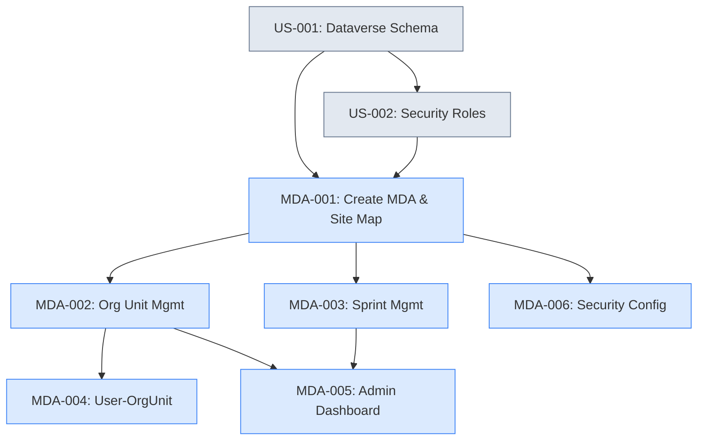

# power1Admin — Product Backlog

> **Platform**: Microsoft Power Platform — Model-Driven App on Dataverse
> **Publisher prefix**: `po_`
> **Sprint cadence**: 1-week sprints
> **Estimation basis**: Person-days (8h), Fibonacci story points (relative complexity)
> **Assumed velocity**: 12–15 points/sprint (configuration-based work)

---

## Backlog Summary

| Metric | Value |
|--------|-------|
| **Total Stories** | 6 |
| **Total Story Points** | 15 |
| **Sprint Cadence** | 1-week sprints |
| **Sprints Estimated** | 2 (at 12–15 pts/sprint) |
| **All stories are** | P1/Must Have |
| **Prerequisites** | US-001 (Dataverse schema), US-002 (Security roles) from powerOne backlog |

### Purpose

The power1Admin app is a **Model-Driven App** dedicated to administrator-only master data management:

- **Organizational Units** — hierarchical org structure (Group → Entity → Domain → Department → Team)
- **Sprints** — time periods with lifecycle status
- **User-OrgUnit Assignments** — team membership via N:N relationship

This data is consumed by the powerOne Canvas App but managed exclusively through power1Admin.

### Why Model-Driven?

| Factor | Benefit |
|--------|---------|
| Auto-generated forms | Zero custom UI development |
| Built-in views with sort/filter | Standard grid experience for admins |
| Native N:N management | Subgrids handle Associate/Disassociate |
| Hierarchical visualization | Native tree view for self-referential tables |
| Security integration | Role-based access out of the box |
| Responsive by default | Works on desktop and tablet without extra effort |
| Audit trail | Built-in field-level change tracking |

---

## Prioritized Backlog

| ID | Title | Points | Priority | Dependencies | Tags |
|----|-------|--------|----------|--------------|------|
| MDA-001 | Create Model-Driven App & Site Map | 3 | P1/Must | US-001, US-002 | model-driven-app, infrastructure |
| MDA-002 | Organizational Unit Management | 3 | P1/Must | MDA-001 | model-driven-app, forms, views |
| MDA-003 | Sprint Management | 3 | P1/Must | MDA-001 | model-driven-app, forms, views |
| MDA-004 | User-OrgUnit Assignment | 2 | P1/Must | MDA-002 | model-driven-app, relationships |
| MDA-005 | Admin Dashboard | 2 | P1/Must | MDA-002, MDA-003 | model-driven-app, dashboard |
| MDA-006 | Security Configuration & Testing | 2 | P1/Must | MDA-001 | model-driven-app, security |

---

## Sprint Planning

> 1-week sprints at 12–15 points/sprint velocity
> Starts after US-001 and US-002 are complete (Dataverse schema + security roles)

| Sprint | Stories | Points | Focus |
|--------|---------|--------|-------|
| **Sprint 1** | MDA-001, MDA-006 | 5 | App creation, site map, security configuration |
| **Sprint 2** | MDA-002, MDA-003, MDA-004, MDA-005 | 10 | All CRUD forms, views, dashboard |

**Total**: 15 points over 2 sprints.

Sprint 2 is heavier but feasible at Model-Driven App velocity since all work is configuration-based (form layout, view columns, business rules, subgrids, dashboard charts).

---

## Dependency Graph

---

## Cross-Project Dependencies

The powerOne Canvas App depends on power1Admin for **data availability**, not code:

| Canvas App Story | Needs from power1Admin | Type |
|-----------------|----------------------|------|
| US-011 (OKR List View) | Org units and sprints in Dataverse | Data |
| US-017 (Filter Bar) | Org unit hierarchy for dropdown | Data |
| US-018 (Pre-set Filters) | User-OrgUnit assignments | Data |
| US-034 (Rituals Dashboard) | Sprint data for filtering | Data |

**Recommendation**: Deploy power1Admin early so administrators can enter reference data while Canvas App development continues.

---

## Effort Comparison: Model-Driven vs Canvas App

The same admin CRUD functionality was originally estimated at 13 points in the Canvas App backlog (US-008: 5, US-009: 5, US-010: 3). The Model-Driven App approach totals 15 points but includes additional scope:

| Scope | Canvas App (original) | Model-Driven App |
|-------|----------------------|-----------------|
| Org Unit CRUD | 5 pts (US-008) | 3 pts (MDA-002) |
| Sprint CRUD | 5 pts (US-009) | 3 pts (MDA-003) |
| User-OrgUnit | 3 pts (US-010) | 2 pts (MDA-004) |
| App creation & site map | — (shared with main app) | 3 pts (MDA-001) |
| Admin dashboard | — | 2 pts (MDA-005) |
| Security config & testing | — | 2 pts (MDA-006) |
| **Total** | **13 pts** | **15 pts** |

The 2-point increase buys a dedicated admin experience with dashboard, hierarchical views, and proper security isolation — while freeing the Canvas App from admin screens.
