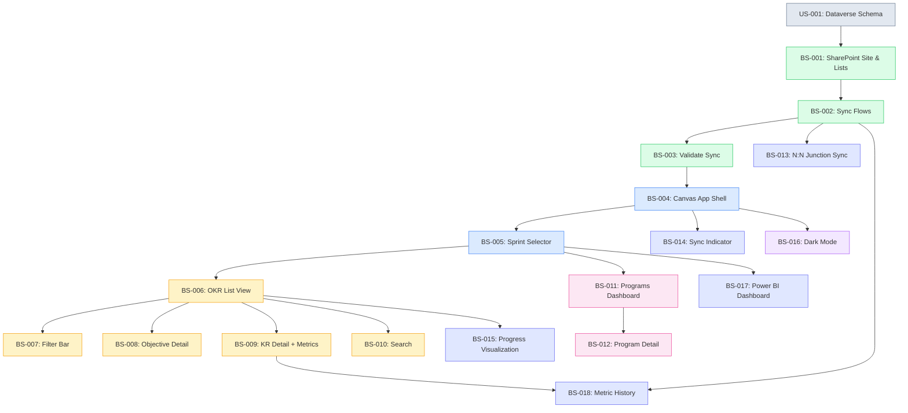

# power1Browse — Product Backlog

> **Platform**: Microsoft Power Platform — Canvas App on SharePoint Lists (standard connector)
> **Data source**: SharePoint Lists (synced from Dataverse via Power Automate)
> **Sprint cadence**: 1-week sprints
> **Estimation basis**: Person-days (8h), Fibonacci story points (relative complexity)
> **Assumed velocity**: 8–10 points/sprint (Canvas App with SharePoint, less complex than Dataverse)

---

## Backlog Summary

| Metric | Value |
|--------|-------|
| **Total Stories** | 18 |
| **Total Story Points** | 79 |
| **Sprint Cadence** | 1-week sprints |
| **Sprints Estimated** | 9 (at 8–10 pts/sprint) |
| **MVP Stories** | 12 (P1/Must Have) — 49 points |
| **MVP Sprints** | 6 |
| **Prerequisites** | US-001 (Dataverse schema), US-002 (Security roles), power1Admin deployed (reference data available) |

### Purpose

The power1Browse app is a **read-only Canvas App** that gives 600 users the ability to browse OKRs, Programs, and metrics **without requiring Power Apps Premium licenses**. It achieves this by reading exclusively from SharePoint Lists (standard connector, included in M365 E3/E5).

### Architecture

```
┌─────────────────────┐    Power Automate     ┌──────────────────────┐
│     Dataverse        │ ──── sync flow ─────▶ │   SharePoint Lists   │
│  (source of truth)   │   (1 premium license) │   (read replica)     │
└──────┬───────────────┘                       └──────────┬───────────┘
       │                                                  │
       │ Premium connector                                │ Standard connector
       │                                                  │
┌──────┴──────────┐                              ┌────────┴──────────┐
│ powerOne        │                              │ power1Browse      │
│ Canvas App      │                              │ Canvas App        │
│ 250 power users │                              │ 600 viewers      │
│ Full CRUD       │                              │ Read-only         │
└─────────────────┘                              └───────────────────┘
```

### Why SharePoint Lists?

| Factor | Benefit |
|--------|---------|
| **Standard connector** | Included in Power Apps for M365 (no premium license) |
| **M365 E3/E5 included** | 600 users already have access |
| **Familiar infrastructure** | SharePoint is already provisioned in the tenant |
| **Delegation support** | Filter, Search, Sort, StartsWith are delegable |
| **30M item capacity** | Lists can hold up to 30 million items |
| **Indexed columns** | Mitigate the 5,000 item view threshold |

### Licensing Impact

| Scenario | Monthly Cost | Annual Cost |
|----------|-------------|-------------|
| All 855 users on Power Apps Premium (€6/user) | €5,130 | €61,560 |
| **Hybrid: 255 Premium + 1 sync flow + 600 M365** | **€1,545** | **€18,540** |
| **Savings** | **€3,585/month** | **€43,020/year** |

**Critical licensing rule**: The Canvas App must use **only standard connectors** (SharePoint, Office 365 Users). Adding even one premium connector triggers €6/user/month for all 600 users.

---

## SharePoint Lists Data Model

### Entity Lists (6)

| # | SharePoint List | Source (Dataverse) | Key Columns | Indexed Columns |
|---|-----------------|-------------------|-------------|-----------------|
| 1 | **Objectives** | po_Objective | Title, Description, Status, Progress, OwnerEmail, OwnerName, SprintId, OrgUnitId, ParentObjectiveId, DataverseId, IsDeleted | Status, SprintId, OrgUnitId |
| 2 | **KeyResults** | po_KeyResult | Title, Status, Progress, ObjectiveId, LinkedChildObjectiveId, DataverseId, IsDeleted | ObjectiveId, Status |
| 3 | **Metrics** | po_Metric | Name, Scale, Direction, BaselineValue, CurrentValue, TargetValue, Unit, KeyResultId, DataverseId, IsDeleted | KeyResultId |
| 4 | **Sprints** | po_Sprint | Name, StartDate, EndDate, Status, DataverseId | Status |
| 5 | **OrgUnits** | po_OrganizationalUnit | Name, Level, ParentUnitId, DataverseId | Level |
| 6 | **Programs** | po_Program | Name, Description, OverallProgress, DataverseId, IsDeleted | — |

### Junction Lists (4 for N:N relationships)

| # | SharePoint List | Source (Dataverse) | Columns |
|---|-----------------|-------------------|---------|
| 7 | **ProgramObjectives** | po_program_objective | ProgramId, ObjectiveId |
| 8 | **ProgramLeads** | po_program_lead | ProgramId, LeadEmail |
| 9 | **KeyResultTeam** | po_keyresult_team | KeyResultId, MemberEmail |
| 10 | **UserOrgUnits** | po_user_orgunit | UserEmail, OrgUnitId |

### Optional Lists

| # | SharePoint List | Source | Purpose |
|---|-----------------|--------|---------|
| 11 | **MetricUpdates** | po_MetricUpdate | Historical trend data (P2) |

**Total: 10 essential lists + 1 optional = 11 SharePoint Lists**

### Design Decisions

- **DataverseId column**: Every entity list stores the Dataverse GUID for sync correlation
- **IsDeleted column**: Soft delete flag (Dataverse has no delete trigger for SharePoint sync)
- **User references via Email**: Text columns with email addresses instead of Dataverse systemuser lookups — display names resolved via Office365Users connector (standard)
- **Self-referencing hierarchies**: ParentObjectiveId and ParentUnitId as number columns pointing to SharePoint item IDs
- **No SharePoint Lookup columns**: Use text/number ID columns instead to avoid the 12 lookup-per-query limit

---

## Sync Mechanism (Power Automate)

### Event-triggered + scheduled fallback

| Component | Detail |
|-----------|--------|
| **Primary sync** | Event-triggered flow per table: "When a row is added, modified or deleted" (Dataverse) → Create/Update/Mark-deleted in SharePoint |
| **Fallback sync** | Scheduled reconciliation every 4 hours: query Dataverse `modifiedon` → upsert to SharePoint |
| **Latency** | Near real-time (seconds to minutes) for event-triggered; max 4 hours for missed events |
| **License** | 1 × Power Automate Premium (~€15/month) for flow owner, or 1 × Process license (~€150/month) |
| **Delete handling** | Set `IsDeleted = true` in SharePoint; Canvas App filters `IsDeleted = false` |

### Sync Flows

| Flow | Tables | Priority |
|------|--------|----------|
| Sync Objectives | po_Objective → Objectives | P1 |
| Sync Key Results | po_KeyResult → KeyResults | P1 |
| Sync Metrics | po_Metric → Metrics | P1 |
| Sync Sprints | po_Sprint → Sprints | P1 |
| Sync OrgUnits | po_OrganizationalUnit → OrgUnits | P1 |
| Sync Programs | po_Program → Programs | P1 |
| Sync Program-Objective links | po_program_objective → ProgramObjectives | P1 |
| Sync Program Leads | po_program_lead → ProgramLeads | P2 |
| Sync KR Team | po_keyresult_team → KeyResultTeam | P2 |
| Sync User-OrgUnit | po_user_orgunit → UserOrgUnits | P2 |
| Reconciliation (all tables) | Scheduled (4h) | P1 |

---

## Prioritized Backlog

| ID | Title | Points | Priority | Epic | Dependencies | Tags |
|----|-------|--------|----------|------|--------------|------|
| BS-001 | Create SharePoint Site & Lists | 5 | P1/Must | B0: Foundation | US-001 | sharepoint;infrastructure |
| BS-002 | Build Dataverse-to-SharePoint Sync Flows | 5 | P1/Must | B0: Foundation | BS-001 | power-automate;sync;dataverse |
| BS-003 | Validate Sync & Data Integrity | 1 | P1/Must | B0: Foundation | BS-002 | testing;sync;validation |
| BS-004 | Create Canvas App with Navigation Shell | 5 | P1/Must | B1: Shell | BS-003 | canvas-app;shell;navigation |
| BS-005 | Implement Sprint Selector | 3 | P1/Must | B1: Shell | BS-004 | canvas-app;shell;filtering |
| BS-006 | OKR List View with Expandable Key Results | 8 | P1/Must | B2: OKR Browser | BS-005 | canvas-app;okr;gallery |
| BS-007 | Filter Bar (Org Unit, Status, Owner) | 5 | P1/Must | B2: OKR Browser | BS-006 | canvas-app;okr;filtering |
| BS-008 | Objective Detail View | 5 | P1/Must | B2: OKR Browser | BS-006 | canvas-app;okr;detail |
| BS-009 | Key Result Detail with Metrics | 5 | P1/Must | B2: OKR Browser | BS-006 | canvas-app;okr;detail;metrics |
| BS-010 | Search Functionality | 3 | P1/Must | B2: OKR Browser | BS-006 | canvas-app;okr;search |
| BS-011 | Programs Dashboard | 5 | P1/Must | B3: Programs | BS-005 | canvas-app;programs;dashboard |
| BS-012 | Program Detail with Linked OKRs | 3 | P1/Must | B3: Programs | BS-011 | canvas-app;programs;detail |
| BS-013 | Build N:N Junction Sync Flows | 3 | P2/Should | B4: Sync Enhancements | BS-002 | power-automate;sync;n-n |
| BS-014 | Add "Last Synced" Indicator | 3 | P2/Should | B4: Sync Enhancements | BS-004 | canvas-app;sync;monitoring |
| BS-015 | Progress Visualization (bars, badges) | 5 | P2/Should | B5: Visual Enhancements | BS-006 | canvas-app;ui;visualization |
| BS-016 | Dark Mode Support | 3 | P3/Could | B5: Visual Enhancements | BS-004 | canvas-app;ui;theming |
| BS-017 | Embedded Power BI Dashboard | 8 | P2/Should | B6: Analytics | BS-005 | power-bi;analytics;embedded |
| BS-018 | Metric History View | 4 | P2/Should | B6: Analytics | BS-009;BS-002 | canvas-app;metrics;history |

---

## Sprint Planning

> 1-week sprints at 8–10 points/sprint velocity
> Starts after Dataverse schema deployed and sync flows validated

| Sprint | Stories | Points | Focus |
|--------|---------|--------|-------|
| **Sprint 1** | BS-001, BS-002, BS-003 | 11 | SharePoint site, lists, sync flows, validation |
| **Sprint 2** | BS-004, BS-005 | 8 | Canvas App creation, shell, sprint selector |
| **Sprint 3** | BS-006 | 8 | OKR list view with expandable KRs |
| **Sprint 4** | BS-007, BS-010 | 8 | Filter bar + search |
| **Sprint 5** | BS-008, BS-009 | 10 | Objective detail + KR detail with metrics |
| **Sprint 6** | BS-011, BS-012 | 8 | Programs dashboard + detail ★ **MVP Complete** |
| **Sprint 7** | BS-013, BS-014 | 6 | N:N junction sync, sync monitoring |
| **Sprint 8** | BS-015, BS-017 | 13 | Progress visualization + Power BI |
| **Sprint 9** | BS-016, BS-018 | 7 | Dark mode + metric history |

### Milestones

| Milestone | Sprint | Stories Complete | Points |
|-----------|--------|-----------------|--------|
| Sync operational | 1 | 3 | 11 |
| App navigable | 2 | 5 | 19 |
| OKR browsing complete | 5 | 10 | 41 |
| **★ MVP** | 6 | 12 | 49 |
| Full product | 9 | 18 | 79 |

---

## Dependency Graph



**Legend**: 🟢 Green = Foundation (B0) | 🔵 Blue = Shell (B1) | 🟡 Yellow = OKR Browser (B2) | 🩷 Pink = Programs (B3) | 🟣 Indigo = Enhancements (B4–B6) | 🟪 Purple = Polish (P3)

---

## SharePoint Constraints & Mitigations

| Constraint | Limit | Mitigation |
|-----------|-------|------------|
| List view threshold | 5,000 items | Index filter columns; partition by sprint (< 500 objectives/sprint typical) |
| Delegation limit | 500–2,000 records | Use only delegable functions (Filter, Search, Sort, StartsWith); set data row limit to 2,000 |
| Lookup columns per query | 12 | Use text/number ID columns instead of SharePoint Lookup type |
| N:N relationships | Not supported natively | Junction lists with compound IDs |
| Row size | 8,000 bytes | OKR data is narrow; Description uses multi-line text (exempt from byte limit) |
| Sync latency | Seconds to minutes | Display "Last synced" timestamp; reconciliation flow every 4 hours |

### Data Volume Assessment

| Table | Per Sprint | Per Year (12 sprints) | Risk |
|-------|-----------|----------------------|------|
| Objectives | 50–200 | ~2,400 | Low |
| Key Results | 150–600 | ~7,200 | Low (indexed) |
| Metrics | 150–1,800 | ~7,200 | Low (indexed) |
| Sprints | N/A | ~50 | None |
| OrgUnits | N/A | ~50–200 | None |
| Programs | N/A | ~20–50 | None |

All tables well within SharePoint limits with proper indexing and sprint-based filtering.

---

## Cross-Project Dependencies

| power1Browse Story | Needs from powerOne/power1Admin | Type |
|-------------------|-------------------------------|------|
| BS-001 (SharePoint Lists) | US-001 (Dataverse schema deployed) | Schema |
| BS-002 (Sync Flows) | Dataverse tables populated with data | Data |
| BS-006 (OKR List View) | Objectives and KRs created via powerOne | Data |
| BS-011 (Programs Dashboard) | Programs created via powerOne | Data |
| BS-017 (Power BI) | Power BI Pro license (M365 E5) or standalone | License |

**Recommendation**: Start power1Browse development after Sprint 2 of powerOne (Dataverse schema + security deployed) so sync flows have data to work with.

---

## Platform Considerations

| Consideration | Detail |
|---------------|--------|
| **Environment** | Deploy Canvas App in the same Power Platform environment as powerOne |
| **Solution** | Include in the same PowerOne solution (`po_` publisher prefix) |
| **License verification** | Check app license designation shows "Standard" before distributing |
| **Connectors allowed** | SharePoint, Office 365 Users only — never add Dataverse or custom connectors |
| **Sync flow owner** | Dedicated service account with Power Automate Premium license |
| **SharePoint site** | Dedicated site collection: `sites/PowerOneBrowse` |
