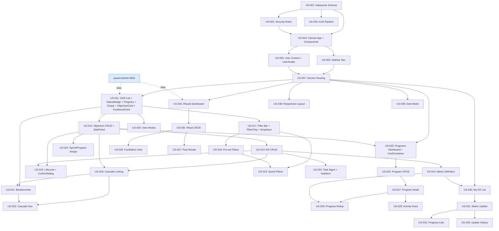

# powerOne — Product Backlog

> **Platform**: Microsoft Power Platform — Canvas App on Dataverse
> **Publisher prefix**: `po_`
> **Sprint cadence**: 1-week sprints
> **Estimation basis**: Person-days (8h), Fibonacci story points (relative complexity)
> **Assumed velocity**: 10–12 points/sprint (12–14 after component library established)

---

## Backlog Summary

| Metric | Value |
|--------|-------|
| **Total Stories** | 36 |
| **Total Story Points** | 184 |
| **Sprint Cadence** | 1-week sprints |
| **MVP (P1/Must Have)** | 24 stories, 127 pts — Sprints 1–13 |
| **Should Have (P2)** | 8 stories, 41 pts — Sprints 14–16 |
| **Could Have (P3)** | 4 stories, 16 pts — Sprints 17–18 |
| **Critical Path** | Schema → Canvas App → Shell → OKR List → OKR CRUD → Filters → Programs → Metrics |

> **Note**: Admin master data CRUD (Org Units, Sprints, User-OrgUnit assignments) has been moved to the **power1Admin** Model-Driven App. See [power1Admin backlog](../power1Admin/backlog.md).

### Effort by Epic

| Epic | Stories | Points | % of Total |
|------|---------|--------|------------|
| E0: Foundation & Infrastructure | 4 | 26 | 14% |
| E1: Application Shell | 5 | 27 | 15% |
| E3: OKR Hierarchy | 14 | 81 | 44% |
| E4: Programs | 5 | 23 | 13% |
| E5: Metrics & Progress | 4 | 14 | 8% |
| E6: OKR Rituals | 4 | 13 | 7% |
| **Total** | **36** | **184** | |

> Epic E2 (Admin & Master Data) is handled entirely by power1Admin.

---

## Component Library Strategy

The Canvas App uses a **Canvas Component Library** (`po_ComponentLibrary`) to build 12 reusable UI elements. Each component is a flat, self-contained unit built from standard controls — Canvas Apps do not support nesting components inside other components. Components are created during the first story that needs them and reused by subsequent stories, reducing effort and ensuring visual consistency.

> **Platform constraint**: `po_ObjectiveCard` and `po_KeyResultCard` internally rebuild status badge, progress bar, and avatar patterns using standard controls rather than referencing other components. Visual changes to these patterns must be updated in each component that uses them. Mitigate by documenting a shared color/sizing convention.

### Component Matrix

| Component | Built In | Reused In | Description |
|-----------|----------|-----------|-------------|
| `po_UserAvatar` | US-006 | US-011, US-023, US-030 | User initials/photo circle with fallback |
| `po_StatusBadge` | US-011 | US-012, US-015, US-025, US-030, US-034 | Colored badge for lifecycle status |
| `po_ProgressIndicator` | US-011 | US-025, US-027, US-030, US-032 | Progress percentage with color coding |
| `po_EmptyState` | US-011 | US-025, US-030, US-034 | Placeholder with icon and message |
| `po_SidePanel` | US-012 | US-013, US-014, US-026, US-035 | Slide-in panel with header, body, footer |
| `po_ConfirmDialog` | US-015 | US-016, US-023 | Modal confirmation for destructive actions |
| `po_TaskItem` | US-023 | — | Checkbox task row with owner and actions |
| `po_FilterChip` | US-017 | US-025, US-034 | Active filter pill with remove button |
| `po_SearchableDropdown` | US-017 | US-012, US-013, US-026 | ComboBox wrapper with search and multi-select |
| `po_CardContainer` | US-025 | US-027, US-034 | Consistent card wrapper for dashboards |
| `po_ObjectiveCard` | US-011 | US-020, US-022, US-027 | Objective row with status, progress, owner, expand/collapse for child KRs |
| `po_KeyResultCard` | US-011 | US-020, US-022, US-030 | Key Result row with status, progress, metric summary, task count |

### Velocity Impact

- **Sprints 1–6** (building components): velocity 10–12 pts/sprint — extra effort to design components for reuse
- **Sprints 7+** (reusing components): velocity 12–14 pts/sprint — stories leveraging existing components are delivered faster
- **Net effect**: the component investment pays back from Sprint 7 onward, accelerating all remaining features

### Component Library Setup

The component library is created as part of US-004 (Canvas App project). All components use the `po_` prefix and follow the product design tokens (teal primary, blue secondary, slate neutral, Inter font).

---

## Prioritized Backlog

| ID | Title | Points | Priority | Epic | Deps | Components |
|----|-------|--------|----------|------|------|------------|
| US-001 | Deploy Dataverse schema | 8 | P1/Must | E0 | — | |
| US-002 | Configure security roles | 5 | P1/Must | E0 | US-001 | |
| US-004 | Create Canvas App project | 8 | P1/Must | E0 | US-001, US-002 | Builds: Component Library project |
| US-005 | Build sidebar navigation | 5 | P1/Must | E1 | US-004 | |
| US-006 | Implement user context | 3 | P1/Must | E1 | US-004 | Builds: po_UserAvatar |
| US-007 | Build section routing | 8 | P1/Must | E1 | US-005, US-006 | |
| US-011 | OKR list view | 8 | P1/Must | E3 | US-007 * | Builds: po_StatusBadge, po_ProgressIndicator, po_EmptyState, po_ObjectiveCard, po_KeyResultCard |
| US-012 | Objective create/edit form | 8 | P1/Must | E3 | US-011 | Builds: po_SidePanel |
| US-013 | Key Result create/edit form | 8 | P1/Must | E3 | US-012 | Reuses: po_SidePanel |
| US-014 | Metric definition on Key Results | 5 | P1/Must | E3 | US-013 | Reuses: po_SidePanel |
| US-015 | Lifecycle status management | 5 | P1/Must | E3 | US-012, US-013 | Builds: po_ConfirmDialog |
| US-016 | Cascade linking | 5 | P1/Must | E3 | US-013, US-012 | Reuses: po_ConfirmDialog |
| US-017 | Filter bar with searchable dropdowns | 8 | P1/Must | E3 | US-011 | Builds: po_FilterChip, po_SearchableDropdown |
| US-018 | Pre-set filters | 3 | P1/Must | E3 | US-017 | |
| US-023 | Task management on Key Results | 5 | P1/Must | E3 | US-013 | Builds: po_TaskItem |
| US-024 | Assign Objectives to Sprint & Programs | 3 | P1/Must | E3 | US-012 | Reuses: po_SearchableDropdown |
| US-025 | Programs dashboard | 5 | P1/Must | E4 | US-007, US-012 | Builds: po_CardContainer; Reuses: po_StatusBadge, po_FilterChip |
| US-026 | Program create/edit form | 5 | P1/Must | E4 | US-025 | Reuses: po_SidePanel, po_SearchableDropdown |
| US-027 | Program detail view | 5 | P1/Must | E4 | US-026 | Reuses: po_ObjectiveCard, po_ProgressIndicator, po_CardContainer |
| US-030 | My Key Results list | 3 | P1/Must | E5 | US-007, US-014 | Reuses: po_KeyResultCard, po_EmptyState |
| US-031 | Metric value update | 5 | P1/Must | E5 | US-030 | |
| US-032 | Progress calculation & display | 3 | P1/Must | E5 | US-031 | Reuses: po_ProgressIndicator |
| US-034 | Rituals dashboard | 3 | P1/Must | E6 | US-007 * | Reuses: po_CardContainer, po_EmptyState, po_FilterChip |
| US-035 | Ritual create/edit form | 3 | P1/Must | E6 | US-034 | Reuses: po_SidePanel |
| | | | | | | |
| US-003 | Set up ALM pipeline | 5 | P2/Should | E0 | US-001 | |
| US-019 | Custom saved filters | 5 | P2/Should | E3 | US-017, US-018 | |
| US-020 | View modes (full, compact, hierarchy) | 8 | P2/Should | E3 | US-011 | Reuses: po_ObjectiveCard, po_KeyResultCard |
| US-021 | Breadcrumb navigation | 5 | P2/Should | E3 | US-011, US-016 | |
| US-022 | Cascade navigation | 5 | P2/Should | E3 | US-016, US-021 | Reuses: po_ObjectiveCard, po_KeyResultCard |
| US-028 | Program progress rollup | 5 | P2/Should | E4 | US-027, US-014 | |
| US-033 | Metric update history | 3 | P2/Should | E5 | US-031 | |
| US-036 | Ritual facilitation view | 5 | P2/Should | E6 | US-035 | |
| | | | | | | |
| US-029 | Activity feed | 3 | P3/Could | E4 | US-027 | |
| US-037 | Past rituals list | 2 | P3/Could | E6 | US-035 | |
| US-038 | Responsive layout | 8 | P3/Could | E1 | US-007 | All components need responsive variants |
| US-039 | Dark mode support | 3 | P3/Could | E1 | US-007 | All components need dark mode variants |

> \* **Cross-project data dependency**: US-011 and US-034 read org unit and sprint data from Dataverse. This data is managed by power1Admin. Sample data must be entered via the Model-Driven App before these stories can be tested.

---

## Sprint Plan — MVP First

> The sprint plan is structured in three phases: **MVP** (P1/Must), **Enhancements** (P2/Should), **Polish** (P3/Could). Each phase delivers a usable product increment.

### Phase 1 — MVP (P1 stories): 127 pts, 13 sprints

| Sprint | Stories | Points | Focus | Components |
|--------|---------|--------|-------|------------|
| **Sprint 1** | US-001, US-002 | 13 | Foundation: Dataverse schema + security roles | — |
| **Sprint 2** | US-004 | 8 | Canvas App project + Component Library setup | Creates `po_ComponentLibrary` |
| **Sprint 3** | US-005, US-006 | 8 | Shell: sidebar navigation + user context | Builds: `po_UserAvatar` |
| **Sprint 4** | US-007 | 8 | Shell: section routing + deep linking | — |
| **Sprint 5** | US-011 | 8 | OKR: list view with expandable Key Results | Builds: `po_StatusBadge`, `po_ProgressIndicator`, `po_EmptyState`, `po_ObjectiveCard`, `po_KeyResultCard` |
| **Sprint 6** | US-012, US-024 | 11 | OKR: Objective CRUD + sprint/program assign | Builds: `po_SidePanel` |
| **Sprint 7** | US-013 | 8 | OKR: Key Result CRUD | Reuses: `po_SidePanel` |
| **Sprint 8** | US-014, US-023 | 10 | OKR: metric definition + task management | Builds: `po_TaskItem`; Reuses: `po_SidePanel` |
| **Sprint 9** | US-015, US-016 | 10 | OKR: lifecycle status + cascade linking | Builds: `po_ConfirmDialog` |
| **Sprint 10** | US-017, US-018 | 11 | OKR: filter bar + pre-set filters | Builds: `po_FilterChip`, `po_SearchableDropdown` |
| **Sprint 11** | US-025, US-026 | 10 | Programs: dashboard + CRUD | Builds: `po_CardContainer`; Reuses: `po_SidePanel`, `po_StatusBadge` |
| **Sprint 12** | US-027, US-034, US-035 | 11 | Program detail + Rituals dashboard & CRUD | Reuses: `po_ObjectiveCard`, `po_SidePanel`, `po_CardContainer` |
| **Sprint 13** | US-030, US-031, US-032 | 11 | Metrics: KR list + value update + progress | Reuses: `po_KeyResultCard`, `po_EmptyState` |

**MVP Milestone**: Sprint 13 — all Must Have features delivered. Product is usable for OKR management, program tracking, metric updates, and ritual scheduling. All 12 components established.

### Phase 2 — Enhancements (P2 stories): 41 pts, 3 sprints

> Component library is fully established. Velocity increases to 12–14 pts/sprint.

| Sprint | Stories | Points | Focus |
|--------|---------|--------|-------|
| **Sprint 14** | US-003, US-033, US-036 | 13 | ALM pipeline + metric history + ritual facilitation |
| **Sprint 15** | US-019, US-028, US-021 | 15 | Saved filters + program rollup + breadcrumbs |
| **Sprint 16** | US-020, US-022 | 13 | View modes + cascade navigation |

### Phase 3 — Polish (P3 stories): 16 pts, 2 sprints

| Sprint | Stories | Points | Focus |
|--------|---------|--------|-------|
| **Sprint 17** | US-029, US-037, US-039 | 8 | Activity feed + past rituals + dark mode |
| **Sprint 18** | US-038 | 8 | Responsive layout |

**Total**: 184 points over 18 sprints (13 MVP + 3 enhancements + 2 polish).

---

## Delivery Milestones

```
Sprint 1  ──────────────────────────────────────────────────── Sprint 18
│                                                              │
├─ Sprint 2:  Component Library created                        │
├─ Sprint 6:  po_SidePanel available → reused by 4 stories    │
├─ Sprint 10: All primitive components built                    │
├─ Sprint 13: ★ MVP COMPLETE (24 P1 stories, 127 pts)         │
├─ Sprint 16: P2 enhancements complete (views, rollup, nav)   │
└─ Sprint 18: Full product complete (all 36 stories, 184 pts) │
```

---

## Dependency Graph



---

## Platform Considerations

### Power Platform Effort Factors

| Factor | Assessment | Impact |
|--------|-----------|--------|
| **Data model** | 11 custom tables, 4 N:N relationships, self-referential lookups | Complex (3/3) |
| **Business logic** | Status transitions, cascade validation, progress rollup | Medium-High (2.5/3) |
| **Integrations** | Dataverse only, no external connectors needed | Low (1/3) |
| **UI complexity** | 15+ screens, three view modes, hierarchy visualization | Complex (3/3) |
| **Security model** | 5 roles with row-level ownership patterns | Medium (2/3) |
| **Component reuse** | 12 shared components across 20+ stories | **Reduces effort in later sprints** |

### Key Canvas App Risks

- **Delegation**: OKR list filtering with multi-column search must use delegable Dataverse functions only. Non-delegable operations limited to 500/2,000 rows.
- **Hierarchy visualization**: Canvas apps lack native tree rendering. The hierarchy view with connector lines requires custom component or creative use of galleries with calculated indentation.
- **N:N relationships**: Canvas apps have limited native support for N:N. Intersect tables may need to be queried explicitly or use Relate/Unrelate functions.
- **Performance**: Loading Objectives with nested Key Results → Metrics requires careful use of delegation and explicit column selection to avoid large payloads.
- **Progress rollup**: Calculating progress across Objectives → Key Results → Metrics may need a Power Automate flow or Dataverse rollup field for performance.
- **Component library limits**: Canvas component libraries have a learning curve and some limitations (e.g., no nested components, limited event model). Plan for workarounds.
