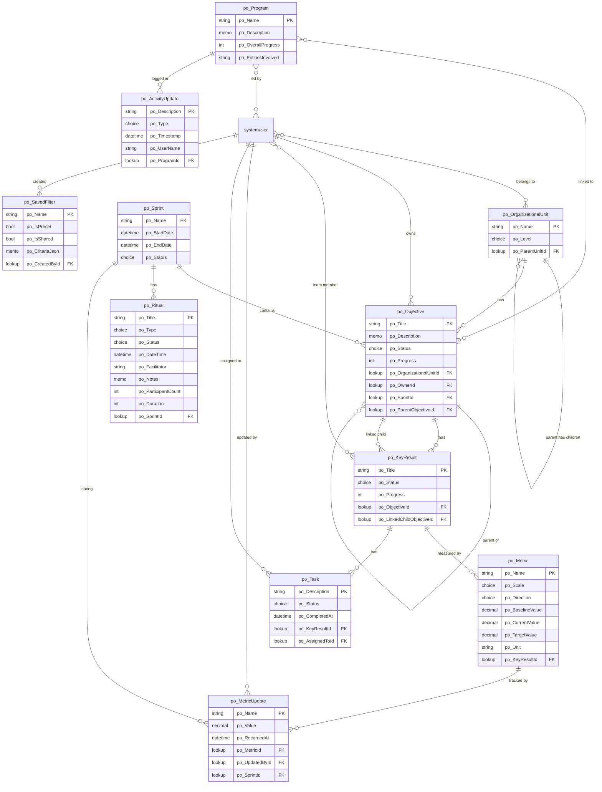

# PowerOne — Dataverse Data Model

> **Publisher prefix**: `po_`
> **Target**: Microsoft Dataverse (Power Platform)
> **SDK**: Dataverse SDK for Python (preview) + Web API for relationships

---

## 1. Table Inventory

| # | Display Name | Schema Name | Description | Type |
|---|---|---|---|---|
| 1 | Organizational Unit | `po_OrganizationalUnit` | A node in the org hierarchy (Group → Entity → Domain → Department → Team) | Custom |
| 2 | Objective | `po_Objective` | An outcome-focused goal at any organizational level with lifecycle management | Custom |
| 3 | Key Result | `po_KeyResult` | A metric-driven measure of success belonging to an Objective | Custom |
| 4 | Metric | `po_Metric` | Defines how progress is quantified for a Key Result (scale, baseline, target) | Custom |
| 5 | Metric Update | `po_MetricUpdate` | A historical snapshot of a Metric's value at a point in time | Custom |
| 6 | Task | `po_Task` | A concrete to-do item assigned to a Key Result, bridging strategy to daily work | Custom |
| 7 | Program | `po_Program` | A cross-entity strategic initiative connecting multiple Objectives | Custom |
| 8 | Sprint | `po_Sprint` | A time-boxed period (e.g., "26.1") with start/end dates and lifecycle | Custom |
| 9 | Ritual | `po_Ritual` | A planning session, check-in, review, or retrospective linked to a Sprint | Custom |
| 10 | Saved Filter | `po_SavedFilter` | A user-defined reusable filter configuration for the OKR Hierarchy view | Custom |
| 11 | Activity Update | `po_ActivityUpdate` | An audit log entry tracking changes to a Program | Custom |
| — | User | `systemuser` | Standard Dataverse user table (not custom) | Standard |
| — | Team | `team` | Standard Dataverse team table — used for KeyResultTeam assignment | Standard |

### Design Decisions

- **User**: Uses the standard `systemuser` table. No custom User table needed — Dataverse security and user management handles this.
- **Admin**: Implemented as a Dataverse **security role**, not a separate table.
- **ObjectiveOwner**: A lookup from Objective → `systemuser`. Not a separate entity.
- **ProgramLead**: An N:N relationship between Program and `systemuser`.
- **KeyResultTeam**: An N:N relationship between Key Result and `systemuser`.
- **ActivityUpdate**: Stored as a separate table with a lookup to Program (not embedded array), following Dataverse relational patterns.

---

## 2. Column Definitions

### 2.1 Organizational Unit (`po_OrganizationalUnit`)

| Display Name | Schema Name | Data Type | Required | Description | Notes |
|---|---|---|---|---|---|
| Name | `po_Name` | String | Yes | Display name of the unit | Primary column |
| Level | `po_Level` | Choice | Yes | Hierarchy level | See `po_OrganizationalLevel` |
| Parent Unit | `po_ParentUnitId` | Lookup | No | Reference to parent unit | Self-referential 1:N |

### 2.2 Objective (`po_Objective`)

| Display Name | Schema Name | Data Type | Required | Description | Notes |
|---|---|---|---|---|---|
| Title | `po_Title` | String | Yes | Outcome-focused goal statement | Primary column |
| Description | `po_Description` | Memo | No | Detailed description | Web API (MemoAttributeMetadata) |
| Status | `po_Status` | Choice | Yes | Lifecycle status | See `po_ObjectiveStatus` |
| Progress | `po_Progress` | Integer | No | Rolled-up progress percentage (0-100) | Computed from Key Results |
| Organizational Unit | `po_OrganizationalUnitId` | Lookup | Yes | Which org unit owns this objective | 1:N from OrganizationalUnit |
| Owner | `po_OwnerId` | Lookup | Yes | User responsible for this objective | 1:N from systemuser |
| Sprint | `po_SprintId` | Lookup | Yes | Sprint this objective belongs to | 1:N from Sprint |
| Parent Objective | `po_ParentObjectiveId` | Lookup | No | Parent objective for cascade alignment | Self-referential 1:N |

### 2.3 Key Result (`po_KeyResult`)

| Display Name | Schema Name | Data Type | Required | Description | Notes |
|---|---|---|---|---|---|
| Title | `po_Title` | String | Yes | Metric-driven success measure | Primary column |
| Status | `po_Status` | Choice | Yes | Lifecycle status | See `po_KeyResultStatus` |
| Progress | `po_Progress` | Integer | No | Rolled-up progress percentage (0-100) | Computed from Metrics |
| Objective | `po_ObjectiveId` | Lookup | Yes | Parent objective | 1:N from Objective |
| Linked Child Objective | `po_LinkedChildObjectiveId` | Lookup | No | Lower-level objective for cascading | 1:N from Objective |

### 2.4 Metric (`po_Metric`)

| Display Name | Schema Name | Data Type | Required | Description | Notes |
|---|---|---|---|---|---|
| Name | `po_Name` | String | Yes | What is being measured | Primary column |
| Scale | `po_Scale` | Choice | Yes | Measurement scale | See `po_MetricScale` |
| Direction | `po_Direction` | Choice | Yes | Target direction | See `po_MetricDirection` |
| Baseline Value | `po_BaselineValue` | Decimal | Yes | Starting value | |
| Current Value | `po_CurrentValue` | Decimal | No | Latest measured value | Updated via MetricUpdate |
| Target Value | `po_TargetValue` | Decimal | Yes | Goal value | |
| Unit | `po_Unit` | String | No | Display unit (e.g., "%", "pts", "EUR") | |
| Key Result | `po_KeyResultId` | Lookup | Yes | Parent key result | 1:N from KeyResult |

### 2.5 Metric Update (`po_MetricUpdate`)

| Display Name | Schema Name | Data Type | Required | Description | Notes |
|---|---|---|---|---|---|
| Name | `po_Name` | String | Yes | Auto-generated label | Primary column |
| Value | `po_Value` | Decimal | Yes | Recorded metric value | |
| Recorded At | `po_RecordedAt` | DateTime | Yes | When this value was captured | |
| Updated By | `po_UpdatedById` | Lookup | No | User who recorded the update | 1:N from systemuser |
| Metric | `po_MetricId` | Lookup | Yes | Parent metric | 1:N from Metric |
| Sprint | `po_SprintId` | Lookup | No | Sprint during which update occurred | 1:N from Sprint |

### 2.6 Task (`po_Task`)

| Display Name | Schema Name | Data Type | Required | Description | Notes |
|---|---|---|---|---|---|
| Description | `po_Description` | String | Yes | What needs to be done | Primary column |
| Status | `po_Status` | Choice | Yes | Task status | See `po_TaskStatus` |
| Assigned To | `po_AssignedToId` | Lookup | Yes | User responsible for this task | 1:N from systemuser |
| Key Result | `po_KeyResultId` | Lookup | Yes | Parent key result | 1:N from KeyResult |
| Completed At | `po_CompletedAt` | DateTime | No | When the task was completed | |

### 2.7 Program (`po_Program`)

| Display Name | Schema Name | Data Type | Required | Description | Notes |
|---|---|---|---|---|---|
| Name | `po_Name` | String | Yes | Program name | Primary column |
| Description | `po_Description` | Memo | No | Detailed description | Web API (MemoAttributeMetadata) |
| Overall Progress | `po_OverallProgress` | Integer | No | Rolled-up progress (0-100) | Avg of linked Objectives |
| Entities Involved | `po_EntitiesInvolved` | String | No | Comma-separated entity names | Denormalized for display |

### 2.8 Sprint (`po_Sprint`)

| Display Name | Schema Name | Data Type | Required | Description | Notes |
|---|---|---|---|---|---|
| Name | `po_Name` | String | Yes | Sprint label (e.g., "26.1") | Primary column |
| Start Date | `po_StartDate` | DateTime | Yes | Sprint start | Date Only format |
| End Date | `po_EndDate` | DateTime | Yes | Sprint end | Date Only format |
| Status | `po_Status` | Choice | Yes | Sprint lifecycle | See `po_SprintStatus` |

### 2.9 Ritual (`po_Ritual`)

| Display Name | Schema Name | Data Type | Required | Description | Notes |
|---|---|---|---|---|---|
| Title | `po_Title` | String | Yes | Ritual session name | Primary column |
| Type | `po_Type` | Choice | Yes | Kind of ritual | See `po_RitualType` |
| Status | `po_Status` | Choice | Yes | Session status | See `po_RitualStatus` |
| Date Time | `po_DateTime` | DateTime | Yes | Scheduled date and time | Date and Time format |
| Facilitator | `po_Facilitator` | String | Yes | Name of facilitator | |
| Notes | `po_Notes` | Memo | No | Session notes and outcomes | Web API (MemoAttributeMetadata) |
| Participant Count | `po_ParticipantCount` | Integer | No | Number of participants | |
| Duration | `po_Duration` | Integer | No | Duration in minutes | |
| Sprint | `po_SprintId` | Lookup | Yes | Linked sprint | 1:N from Sprint |

### 2.10 Saved Filter (`po_SavedFilter`)

| Display Name | Schema Name | Data Type | Required | Description | Notes |
|---|---|---|---|---|---|
| Name | `po_Name` | String | Yes | Filter label | Primary column |
| Is Preset | `po_IsPreset` | Boolean | Yes | System-provided preset filter? | Default: No |
| Is Shared | `po_IsShared` | Boolean | No | Visible to other users? | Default: No |
| Criteria JSON | `po_CriteriaJson` | Memo | Yes | Serialized filter criteria | JSON string |
| Created By User | `po_CreatedById` | Lookup | No | User who created the filter | 1:N from systemuser |

### 2.11 Activity Update (`po_ActivityUpdate`)

| Display Name | Schema Name | Data Type | Required | Description | Notes |
|---|---|---|---|---|---|
| Description | `po_Description` | String | Yes | What happened | Primary column |
| Type | `po_Type` | Choice | Yes | Kind of activity | See `po_ActivityType` |
| Timestamp | `po_Timestamp` | DateTime | Yes | When it happened | |
| User Name | `po_UserName` | String | Yes | Display name of user who acted | Denormalized |
| Program | `po_ProgramId` | Lookup | Yes | Parent program | 1:N from Program |

---

## 3. Relationship Map

### 3.1 One-to-Many (1:N) Relationships

| # | Parent Table (1) | Child Table (N) | Lookup Column | Relationship Name | Cascade Delete |
|---|---|---|---|---|---|
| R1 | `po_OrganizationalUnit` | `po_OrganizationalUnit` | `po_ParentUnitId` | `po_orgunit_1N_orgunit` | RemoveLink |
| R2 | `po_OrganizationalUnit` | `po_Objective` | `po_OrganizationalUnitId` | `po_orgunit_1N_objective` | Restrict |
| R3 | `systemuser` | `po_Objective` | `po_OwnerId` | `po_user_1N_objective` | RemoveLink |
| R4 | `po_Sprint` | `po_Objective` | `po_SprintId` | `po_sprint_1N_objective` | Restrict |
| R5 | `po_Objective` | `po_Objective` | `po_ParentObjectiveId` | `po_objective_1N_objective` | RemoveLink |
| R6 | `po_Objective` | `po_KeyResult` | `po_ObjectiveId` | `po_objective_1N_keyresult` | Cascade |
| R7 | `po_Objective` | `po_KeyResult` | `po_LinkedChildObjectiveId` | `po_objective_1N_keyresult_linked` | RemoveLink |
| R8 | `po_KeyResult` | `po_Metric` | `po_KeyResultId` | `po_keyresult_1N_metric` | Cascade |
| R9 | `po_Metric` | `po_MetricUpdate` | `po_MetricId` | `po_metric_1N_metricupdate` | Cascade |
| R10 | `systemuser` | `po_MetricUpdate` | `po_UpdatedById` | `po_user_1N_metricupdate` | RemoveLink |
| R11 | `po_Sprint` | `po_MetricUpdate` | `po_SprintId` | `po_sprint_1N_metricupdate` | RemoveLink |
| R12 | `po_KeyResult` | `po_Task` | `po_KeyResultId` | `po_keyresult_1N_task` | Cascade |
| R13 | `systemuser` | `po_Task` | `po_AssignedToId` | `po_user_1N_task` | RemoveLink |
| R14 | `po_Sprint` | `po_Ritual` | `po_SprintId` | `po_sprint_1N_ritual` | Restrict |
| R15 | `systemuser` | `po_SavedFilter` | `po_CreatedById` | `po_user_1N_savedfilter` | Cascade |
| R16 | `po_Program` | `po_ActivityUpdate` | `po_ProgramId` | `po_program_1N_activityupdate` | Cascade |

### 3.2 Many-to-Many (N:N) Relationships

| # | Entity 1 | Entity 2 | Relationship Name | Intersect Table | Purpose |
|---|---|---|---|---|---|
| R17 | `po_Program` | `po_Objective` | `po_program_objective` | `po_program_objective` | Programs link to multiple Objectives and vice versa |
| R18 | `po_Program` | `systemuser` | `po_program_lead` | `po_program_lead` | Programs have one or more co-leads |
| R19 | `po_KeyResult` | `systemuser` | `po_keyresult_team` | `po_keyresult_team` | Key Results are managed by a team of users |
| R20 | `systemuser` | `po_OrganizationalUnit` | `po_user_orgunit` | `po_user_orgunit` | Users belong to one or more org units |

---

## 4. Choice (Option Set) Definitions

### `po_OrganizationalLevel`

| Label | Value | Used By |
|---|---|---|
| Group | 100000000 | `po_OrganizationalUnit.po_Level` |
| Entity | 100000001 | |
| Domain | 100000002 | |
| Department | 100000003 | |
| Team | 100000004 | |

### `po_ObjectiveStatus`

| Label | Value | Used By |
|---|---|---|
| Draft | 100000000 | `po_Objective.po_Status` |
| Accepted | 100000001 | |
| Active | 100000002 | |
| Done | 100000003 | |
| Archived | 100000004 | |
| Cancelled | 100000005 | |

### `po_KeyResultStatus`

| Label | Value | Used By |
|---|---|---|
| Draft | 100000000 | `po_KeyResult.po_Status` |
| Accepted | 100000001 | |
| Active | 100000002 | |
| Done | 100000003 | |
| Archived | 100000004 | |
| Cancelled | 100000005 | |

### `po_SprintStatus`

| Label | Value | Used By |
|---|---|---|
| Inactive | 100000000 | `po_Sprint.po_Status` |
| Active | 100000001 | |
| Done | 100000002 | |

### `po_TaskStatus`

| Label | Value | Used By |
|---|---|---|
| Open | 100000000 | `po_Task.po_Status` |
| Completed | 100000001 | |

### `po_MetricScale`

| Label | Value | Used By |
|---|---|---|
| Percentage | 100000000 | `po_Metric.po_Scale` |
| Absolute | 100000001 | |
| Score | 100000002 | |

### `po_MetricDirection`

| Label | Value | Used By |
|---|---|---|
| Increase | 100000000 | `po_Metric.po_Direction` |
| Decrease | 100000001 | |

### `po_RitualType`

| Label | Value | Used By |
|---|---|---|
| Planning | 100000000 | `po_Ritual.po_Type` |
| Check-in | 100000001 | |
| Review | 100000002 | |
| Retrospective | 100000003 | |

### `po_RitualStatus`

| Label | Value | Used By |
|---|---|---|
| Upcoming | 100000000 | `po_Ritual.po_Status` |
| In Progress | 100000001 | |
| Completed | 100000002 | |

### `po_ActivityType`

| Label | Value | Used By |
|---|---|---|
| Program Created | 100000000 | `po_ActivityUpdate.po_Type` |
| Program Edited | 100000001 | |
| Objective Added | 100000002 | |
| Objective Removed | 100000003 | |
| Progress Update | 100000004 | |
| Lead Added | 100000005 | |
| Lead Removed | 100000006 | |

---

## 5. Entity Relationship Diagram

---

## 6. Summary Statistics

| Metric | Count |
|---|---|
| Custom tables | 11 |
| Standard tables used | 2 (systemuser, team) |
| 1:N relationships | 16 |
| N:N relationships | 4 |
| Choice columns | 10 |
| Lookup columns | 16 |
| Memo columns (Web API) | 4 |

---

## 7. Implementation Notes

### Naming Convention

| Property | Convention | Example |
|---|---|---|
| **Schema name** | Publisher prefix + PascalCase | `po_Objective` |
| **Logical name** | Lowercase schema name (auto-derived) | `po_objective` |
| **Display name** | Clean, human-readable — no prefix | Objective |
| **Plural display name** | Clean plural form | Objectives |

The `po_` publisher prefix appears on schema/logical names only. Display names shown in the UI (site map, forms, views, search) are clean. The creation script sets display names explicitly via the Web API after table creation.

### SDK vs Web API Split

| Operation | Tool |
|---|---|
| Create global choices (option sets) | Web API (`GlobalOptionSetDefinitions`) |
| Create tables + primitive columns | Python SDK (`create_table()`) |
| Create choice columns referencing global option sets | Web API (`PicklistAttributeMetadata` with `GlobalOptionSet@odata.bind`) |
| Set table and column display names | Web API (PATCH `EntityDefinitions`, `Attributes`) |
| Create Memo columns (Description, Notes, CriteriaJson) | Web API (`MemoAttributeMetadata`) |
| Create all 1:N relationships (R1–R16) | Web API (`OneToManyRelationshipMetadata`) |
| Create all N:N relationships (R17–R20) | Web API (`ManyToManyRelationshipMetadata`) |
| Create records, query, update, delete | Python SDK (CRUD methods) |
| Seed sample data | Python SDK (`create()` with list payloads) |

> **Note on choices**: All 10 choice definitions are created as **global option sets** with proper schema names (e.g., `po_SprintStatus`). Choice columns are then added to tables referencing these global option sets, ensuring they are named, reusable, and visible under Settings → Customizations → Option Sets.

### Recommended Build Order

0. **Global choices**: Create all 10 global option sets via Web API (must exist before choice columns)
1. **Foundation tables** (no dependencies): `po_Sprint`, `po_OrganizationalUnit`
2. **Core OKR tables**: `po_Objective` → `po_KeyResult` → `po_Metric` → `po_MetricUpdate` → `po_Task`
3. **Programs**: `po_Program` → `po_ActivityUpdate`
4. **Process**: `po_Ritual`
5. **User features**: `po_SavedFilter`
5b. **Choice columns**: Add 10 picklist columns referencing the global option sets from step 0
6. **Display names**: Set clean display names on all tables and columns (removes `po_` from UI)
7. **Memo columns**: Description, Notes, CriteriaJson
8. **Relationships**: All 1:N first, then N:N
9. **Seed data**: Sample records for each table

### Security Roles

| Role | Permissions |
|---|---|
| **Admin** | Full CRUD on all tables, manage org units, sprints, rituals |
| **Program Lead** | Full CRUD on Programs and ActivityUpdates, read/update Objectives |
| **Objective Owner** | Full CRUD on owned Objectives and child Key Results/Metrics/Tasks |
| **Team Member** | Read all, update assigned Tasks and Metrics, create MetricUpdates |
| **Viewer** | Read-only access to all tables |
